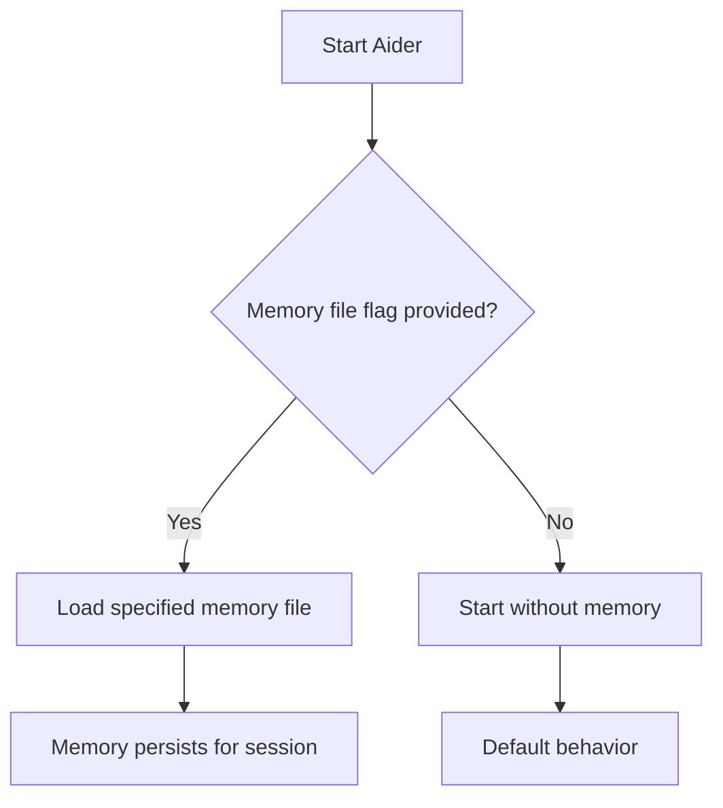

# Aider Memory System

Aider takes a manual approach to persistent memory, requiring explicit inclusion at startup and focusing on session-based persistence rather than automatic loading.

## Key Features

- **Manual Inclusion**: Memory file must be explicitly included with a command-line flag
- **Session Persistence**: Once loaded, memory persists for the session duration
- **Markdown Format**: Uses standard Markdown for content structure
- **No Built-in Scoping**: Applied to the entire session regardless of file context
- **Flexible Location**: Can be placed anywhere in the file system

## Canonical Locations & Precedence

Aider does not have a default automatic loading mechanism, but uses a common convention:

```text
<repo-root>/.aider.memory.md    # Commonly used location, but can be placed anywhere
```

The file must be explicitly referenced when starting an Aider session:

```bash
aider --memory-file .aider.memory.md
```

## Directory Structure Example

```text
$HOME/
└── projects/
    └── myproject/
        ├── .aider.memory.md          # Project memory file
        ├── src/                      # Source code directory
        └── package.json              # Project files
```

## File Structure Examples

Aider memory files use standard Markdown format with headings to organize content:

```markdown
# Project Context
This project is a React application with a Node.js backend.

# Coding Standards
- Use functional components for all new React code
- Follow ESLint rules in .eslintrc
- Test all components with React Testing Library

# Database Schema
Users:
- id: UUID
- email: String
- passwordHash: String
- createdAt: Date
```

## Loading Behavior



## Content Organization

Effective Aider memory files typically include:

1. **Project Context**: Description of the project's purpose and architecture
2. **Coding Standards**: Conventions and style guidelines to follow
3. **Architecture Details**: System design, components, and relationships
4. **Domain Knowledge**: Business rules and technical requirements

Example:

```markdown
# Project Context
A microservice-based e-commerce platform with React frontend and Node.js microservices.

# Architecture
- Frontend: React SPA with Redux
- API Gateway: Express.js
- Services: Product, Order, User microservices
- Database: MongoDB for each service

# Coding Standards
- Functional React components with hooks
- Jest and React Testing Library for tests
- ESLint with Airbnb config
```

## Best Practices for Aider Memory

- **Organize with headings**: Use clear Markdown headings for structure
- **Focus on what won't change**: Include stable information that won't need frequent updates
- **Prioritize architecture knowledge**: Include system design information that isn't obvious from code
- **Include examples**: Provide concrete examples of patterns to follow
- **Document command patterns**: Include common CLI commands specific to your project

## Limitations and Considerations

- Manual loading requirement can be forgotten
- No automatic updates as the project evolves
- All content is applied to all interactions regardless of relevance
- No hierarchical structure for different aspects of the project

## Version Information

| Aspect | Details |
|--------|---------|
| Last-verified release | v1.0.0 (May 2025) |
| Primary docs | Aider documentation website |
| Memory specification | Updated in v1.0 (May 2025) |

## Mixdown Integration

> [!NOTE]
> 🚧 Pending Mixdown integration