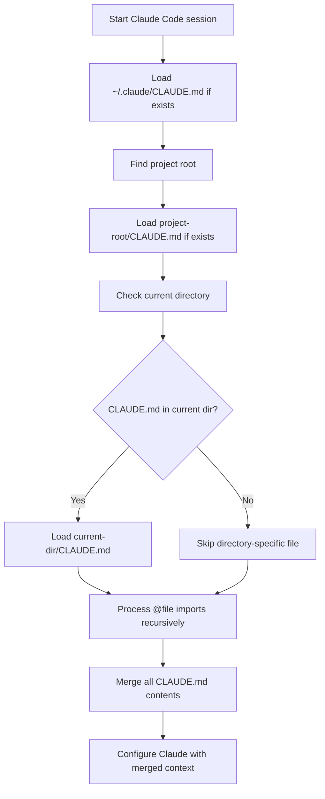

# Claude Code Memory System

Claude Code uses plain Markdown files (`CLAUDE.md`) with a powerful import system to manage persistent rules across directories.

## Key Features

- **Hierarchical Loading:** Loads CLAUDE.md files from root directory and relevant subdirectories
- **Import Mechanism:** `@file` syntax to pull in content from other files
- **Global + Project:** Combines global user preferences with project-specific rules
- **Automatic Discovery:** Finds and loads relevant CLAUDE.md files based on current working directory
- **Recursive Imports:** Can reference content in other files for modular organization

## Canonical Locations & Precedence

Claude Code loads memory files from multiple locations, with precedence given to more specific locations:

```text
$HOME/.claude/CLAUDE.md                   # Global user preferences
<repo-root>/CLAUDE.md                     # Project-wide rules
<current-directory>/CLAUDE.md             # Directory-specific rules
<parent-directories>/CLAUDE.md            # Parent directory rules (if navigating deeper)
```

## Directory Structure Example

```text
$HOME/
├── .claude/
│   └── CLAUDE.md                 # Global user preferences
└── projects/
    └── myproject/
        ├── CLAUDE.md                 # Project-level memory file
        ├── docs/
        │   └── ARCHITECTURE.md       # Documentation referenced by imports
        └── api/
            └── CLAUDE.md             # Component-specific memory (loaded when in API context)
```

## Import Mechanism

Claude Code's unique `@file` syntax allows importing content from other files:

```markdown
# Project Guidelines
See @docs/ARCHITECTURE.md for the system overview.

# Coding Standards
- Follow RESTful principles for API endpoints
- Document all functions with JSDoc comments
```

When Claude Code encounters `@docs/ARCHITECTURE.md`, it will:

1. Resolve the path relative to the current CLAUDE.md file
2. Load the content of the referenced file
3. Include that content in the context provided to the AI

This allows for modular organization of content across multiple files.

## Loading Behavior



## Content Organization

CLAUDE.md files typically organize content with clear headings and sections:

```markdown
# Project Overview
Brief description of the project purpose and architecture.

# Key Concepts
- **Term 1**: Definition and explanation
- **Term 2**: Definition and explanation

# Coding Standards
Guidelines for code style, patterns, and practices.

# Testing Requirements
Expectations for test coverage and methodology.
```

## Best Practices for Claude Code Memory

- **Use consistent heading structure**: Makes it easier for Claude to reference specific sections
- **Balance conciseness with completeness**: Include necessary details without overwhelming context
- **Leverage @file imports for modularity**: Break large documents into focused components
- **Place CLAUDE.md files strategically**: Put them at the root of logical components or modules
- **Maintain a clear hierarchy**: Global preferences → project standards → component-specific guidance
- **Use plain Markdown**: Avoid complex formatting that might distract from content
- **Update regularly**: Keep the content current with project evolution

## Version Information

| Aspect | Details |
|--------|---------|
| Last-verified release | v1.5.0 (May 2025) |
| Primary docs | Claude Code documentation website |
| Memory specification | Updated in v1.5 (May 2025) |

## Mixdown Integration

> [!NOTE]
> 🚧 Pending Mixdown integration