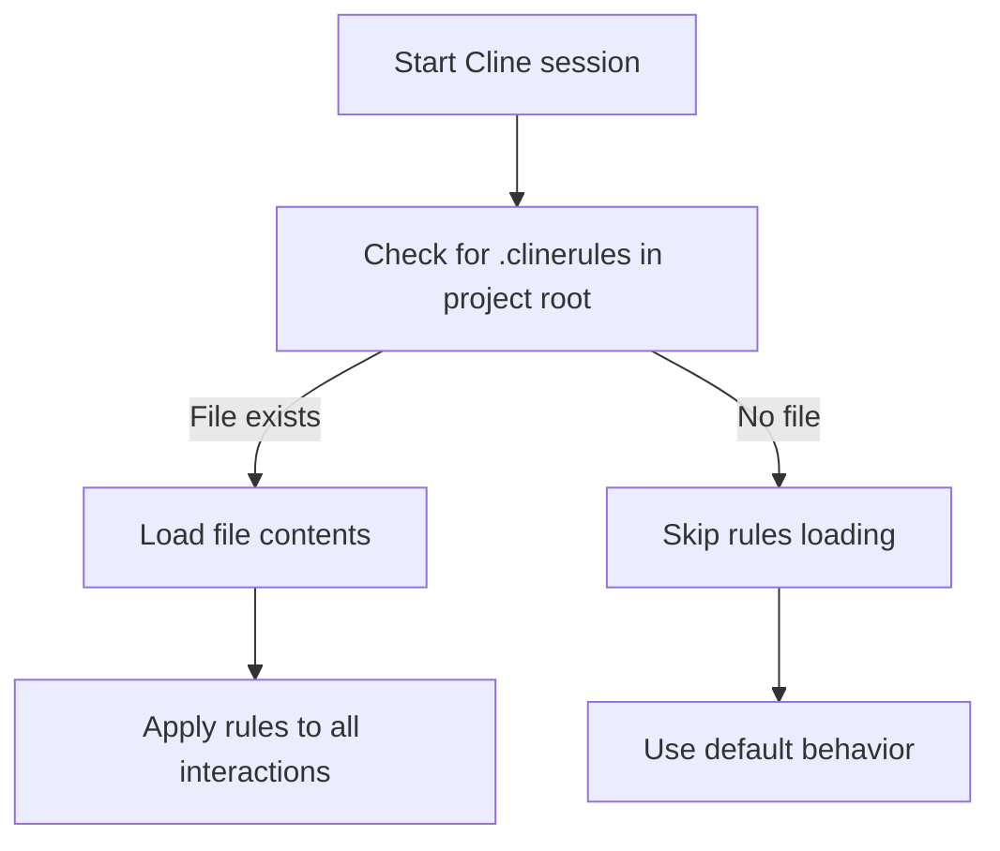

# Cline Rules System

Cline uses a straightforward single-file approach for project-level rules, focusing on simplicity and minimal configuration.

## Key Features

- **Single File**: One `.clinerules` file in the project root
- **Plain Text**: Simple, unstructured content without special formatting requirements
- **Global Context**: Applied to all interactions within the project
- **No Scoping Mechanism**: Rules apply equally to all files and operations
- **Low Configuration**: Minimal setup required to start using rules

## Canonical Locations & Precedence

Cline uses a simple, single-location approach for rules:

```text
<repo-root>/.clinerules        # Project-level rules file
```

Unlike many other tools, Cline does not have a global/user-level rules file or a hierarchical system.

## Directory Structure Example

```text
$HOME/
└── projects/
    └── myproject/
        ├── .clinerules               # Project-level rules file
        ├── src/                      # Source code directory
        └── package.json              # Project files
```

## File Structure Examples

Cline rules files use plain text format with no specific structure requirements:

```text
This is a Node.js project using Express and MongoDB.
Follow the existing code style with 2-space indentation.
Test all API endpoints using Jest.
Document new functions with JSDoc comments.
```

## Loading Behavior



## Content Organization

Effective Cline rules files typically include:

1. **Project Overview**: Brief description of the project and its purpose
2. **Technology Stack**: Languages, frameworks, and libraries used
3. **Code Style**: Formatting preferences and coding standards
4. **Testing Approach**: Expected testing methods and coverage

Example:

```text
# Project Overview
This is a CLI tool for processing markdown files.

# Technology Stack
- TypeScript for all source code
- Commander.js for CLI parsing
- Jest for testing

# Code Style
- Use 2-space indentation
- Maximum line length of 100 characters
- Prefer arrow functions over function declarations

# Testing
- Use Jest snapshot testing for output validation
- Unit test all public functions
```

## Best Practices for Cline Rules

- **Keep it simple**: Focus on the most important guidance
- **Use clear headings**: Even though it's plain text, structure helps readability
- **Be specific**: Give concrete examples where possible
- **Focus on project specifics**: Include information the AI couldn't easily infer
- **Update regularly**: Keep the content current as your project evolves

## Limitations and Considerations

- No scoping mechanism for specific files or directories
- No file relationships or imports
- Limited structural enforcement
- No version control for rules beyond standard Git

## Version Information

| Aspect | Details |
|--------|---------|
| Last-verified release | v0.9.0 (May 2025) |
| Primary docs | Cline documentation website |
| Rules specification | Updated in v0.9 (May 2025) |

## Mixdown Integration

> [!NOTE]
> 🚧 Pending Mixdown integration