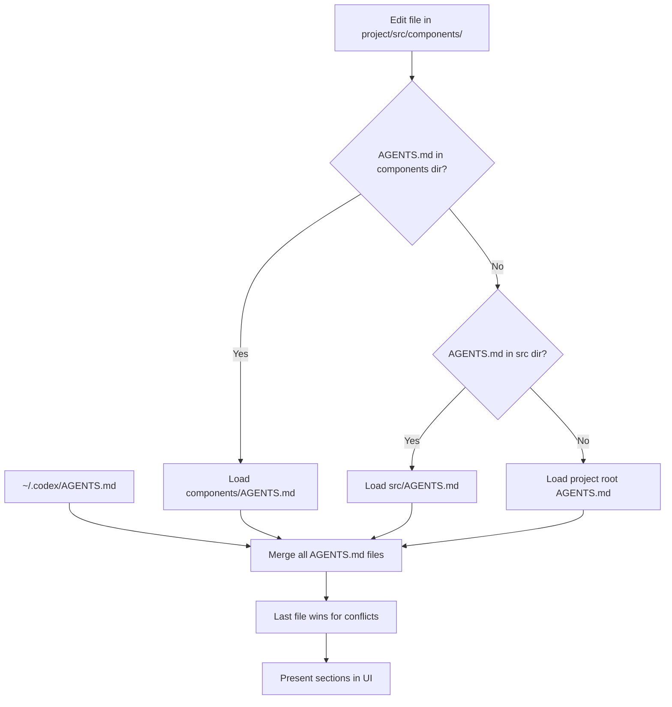

# OpenAI Codex AGENTS System

OpenAI Codex uses a section-based merging approach with a hierarchical loading system for its AGENTS.md files.

## Key Features

- **Hierarchical Loading:** Loads AGENTS.md files from personal, project, and subdirectory levels
- **Section-Based Merging:** Uses Markdown headings (## ...) as section labels for organization
- **Path Walking:** For edited files, walks upward from file path, stopping at first AGENTS.md
- **UI Integration:** Section headings are surfaced in the UI for navigation
- **Conflict Resolution:** Last file wins for conflicting sections (deeper files override shallower)

## Canonical Locations & Precedence

Codex AGENTS uses a three-tier hierarchy for loading rules, with a clear precedence order (highest → lowest):

```text
~/.codex/AGENTS.md                # Personal, applies to every repo
<repo-root>/AGENTS.md             # Project-wide defaults
<any-subdir>/AGENTS.md            # Loaded only when files in that dir are touched
```

Codex merges these files with a "last one wins" policy for conflicting advice. You can disable loading entirely with `codex --no-project-doc` or the environment variable `CODEX_DISABLE_PROJECT_DOC=1`.

## Directory Structure Example

```text
$HOME/
├── .codex/
│   └── AGENTS.md                 # Personal preferences (applies to all repos)
└── projects/
    └── myproject/
        ├── AGENTS.md             # Project-wide defaults
        └── frontend/
            └── AGENTS.md         # Frontend-specific rules
```

## File Structure Example

AGENTS.md files use pure Markdown with section headings (## ...) as the primary organizational structure:

```markdown
## Coding Standards
- Use tabs for indentation
- Follow PEP 8 for Python code
- Maximum line length is 80 characters

## Error Handling
- Use structured error objects
- Log all errors with contextual information
- Handle all Promise rejections

## Testing
- Write unit tests for all new functionality
- Use descriptive test names
- Mock external dependencies
```

The simplicity of this format is intentional - no YAML front-matter or special syntax is required.

## Loading Behavior

When working with files in a project, Codex AGENTS uses a path-walking mechanism to find relevant rules:



## Section-Based Merging

A key feature of Codex AGENTS is its section-based merging:

1. Files are loaded from all three tiers
2. Sections are identified by their ## headings
3. For matching headings (e.g., "## Coding Standards" appears in multiple files):
   - Content from deeper files is appended after content from shallower files
   - This allows for extending rather than completely replacing sections
4. For conflicting content, the deeper file's version takes precedence
5. Headings are surfaced in the Codex UI for easy navigation

## Content Organization

Effective AGENTS.md files use a clear heading structure with concise, actionable bullet points:

```markdown
## Code Style
- Follow Black (line-length = 88)
- Prefer explicit variable names; no abbreviations

## Testing
- Always run: `pytest -q tests/`
- Reject any patch if coverage Δ < 0

## PR Template
- Title: `[Feat] concise summary`
- Body must include "Testing Done" and "Risk Assessment"
```

## Best Practices for AGENTS.md Files

- **Keep it short & actionable**: Long prose dilutes token budget; Codex already parses code for style cues
- **One concern per heading**: Lets Codex selectively quote the relevant section in PR descriptions
- **Use imperative bullets**: Mirrors how human reviewers write code-review checklists
- **Create sub-folder files for monorepos**: Prevents JavaScript rules from bleeding into Go micro-services
- **Avoid redundant code-style rules**: Model infers them; redundant instructions waste space
- **Create clear PR templates**: Include expectations for title format, body content, and review process
- **Focus on project-specific concerns**: Emphasize things the AI couldn't easily infer from the codebase

## Limitations and Considerations

- **No YAML front-matter support**: Currently not supported, but may be added in future
- **No hard size limit documented**: Context ceiling is at model-level (192k tokens)
- **No glob/path selectors**: Currently requested by community but not implemented
- **Alphabetical concatenation**: Current loader concatenates alphabetically

## Version Information

| Aspect | Details |
|--------|---------|
| Last-verified release | v2.0.0 (May 2025) |
| Primary docs | OpenAI Codex documentation website |
| AGENTS specification | Updated in v2.0 (May 2025) |

## Mixdown Integration

> [!NOTE]
> 🚧 Pending Mixdown integration