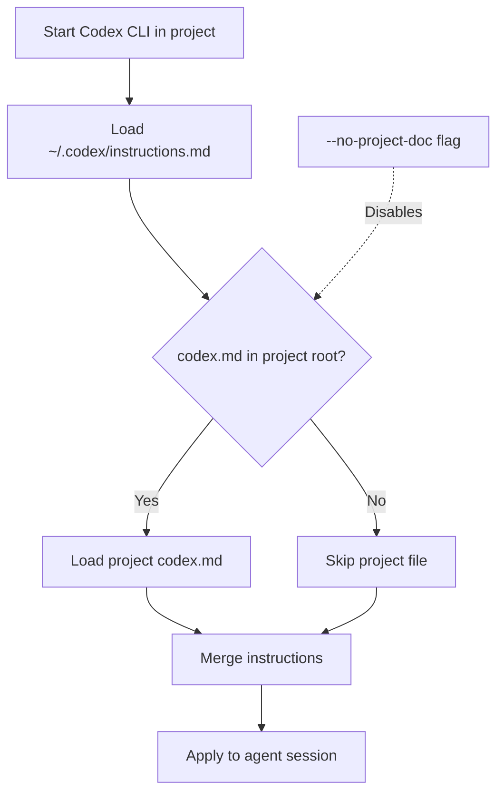

# OpenAI Codex CLI System

OpenAI Codex CLI uses a layered instructions approach with Markdown files to guide the AI agent's behavior in the terminal.

## Key Features

- **Layered Instructions:** Combines global user preferences with project-specific guidelines
- **Command Policy Control:** Guides what commands the agent can and should run
- **Project Context:** Provides information about repository structure and standards
- **Terminal Integration:** Designed for developers who work primarily in the terminal
- **Version Control Awareness:** Works seamlessly with Git repositories

## Canonical Locations & Precedence

Codex CLI uses a two-tier system for managing instructions (highest → lowest precedence):

```text
~/.codex/instructions.md         # Personal, applies to every repo
<repo-root>/codex.md             # Project-wide defaults
```

Instructions are merged, with project-specific instructions taking precedence over conflicting personal instructions. Loading can be disabled with the `--no-project-doc` flag or by setting the environment variable `CODEX_DISABLE_PROJECT_DOC=1`.

## Directory Structure Example

```text
$HOME/
├── .codex/
│   ├── instructions.md          # Personal preferences (applies to all repos)
│   └── config.yaml              # Configuration for the CLI tool itself
└── projects/
    └── myproject/
        ├── codex.md             # Project-specific instructions
        └── .codex/              # Optional shared workspace directory
            └── plan.md          # Planning document created by the agent
```

## File Structure Example

Codex CLI rules files use standard Markdown with clear headings and sections:

```markdown
# Coding Standards
- Always use TypeScript for new JavaScript files
- Follow AirBnB style guide for linting
- Maximum line length is 100 characters
- All exports should be typed

# Testing Requirements
- Write unit tests for all new functionality
- Use Jest for testing framework
- Maintain at least 80% code coverage

# Command Policy
- Never use git force push unless explicitly requested
- Always run linting before committing code
- Use npm for package management
```

## Loading Behavior

When starting a Codex CLI session in a project, the instructions are loaded as follows:



## Content Organization

Effective rules files typically include:

1. **Project Overview**: High-level description of the project's purpose and architecture
2. **Coding Standards**: Language-specific guidance and style preferences
3. **Testing Requirements**: Test frameworks, coverage requirements, and procedures
4. **Command Policy**: Rules about what commands the agent should run or avoid
5. **Workflow Guidelines**: How to handle common development tasks
6. **Architecture Overview**: Key components and their relationships

## The .codex/ Directory

The `.codex/` directory in your working directory can act as a shared workspace for you and the agent:

- Not special-cased by the CLI (treated like any other directory)
- Useful for storing planning documents, diagrams, and progress tracking
- Common practice is to have the agent create dated files (e.g., `plan_2025-05-19.md`)
- Helpful for maintaining continuity across sessions

## Best Practices for Codex CLI Instructions

- **Keep instructions clear, concise, and specific**: Focus on what's unique to your project
- **Organize by topic with descriptive headings**: Makes it easier to find and update specific guidance
- **Include project-specific architectural details**: Help the agent understand the codebase structure
- **Define command policies to prevent unwanted actions**: Safety guardrails for operations
- **Create a consistent workflow pattern with clear steps**: Standard procedures for common tasks
- **Use the .codex/ directory for shared agent workspace**: Helps track planning and progress
- **Regular maintenance**: Update instructions as the project evolves

## Limitations and Considerations

- Not compatible with Zero Data Retention (ZDR) policies
- Consider token limitations when writing instructions
- The CLI requires an OpenAI API key with sufficient permissions
- Set environment variables for proper authentication:
  ```
  export OPENAI_API_KEY="your-api-key-here"
  ```

## Version Information

| Aspect | Details |
|--------|---------|
| Last-verified release | v1.2.0 (May 2025) |
| Primary docs | OpenAI Codex CLI documentation website |
| Instructions specification | Updated in v1.2 (May 2025) |

## Mixdown Integration

> [!NOTE]
> 🚧 Pending Mixdown integration