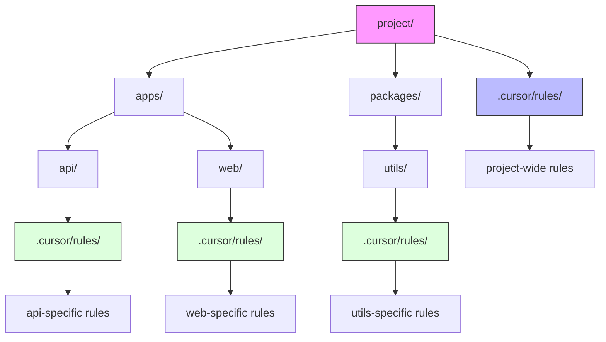
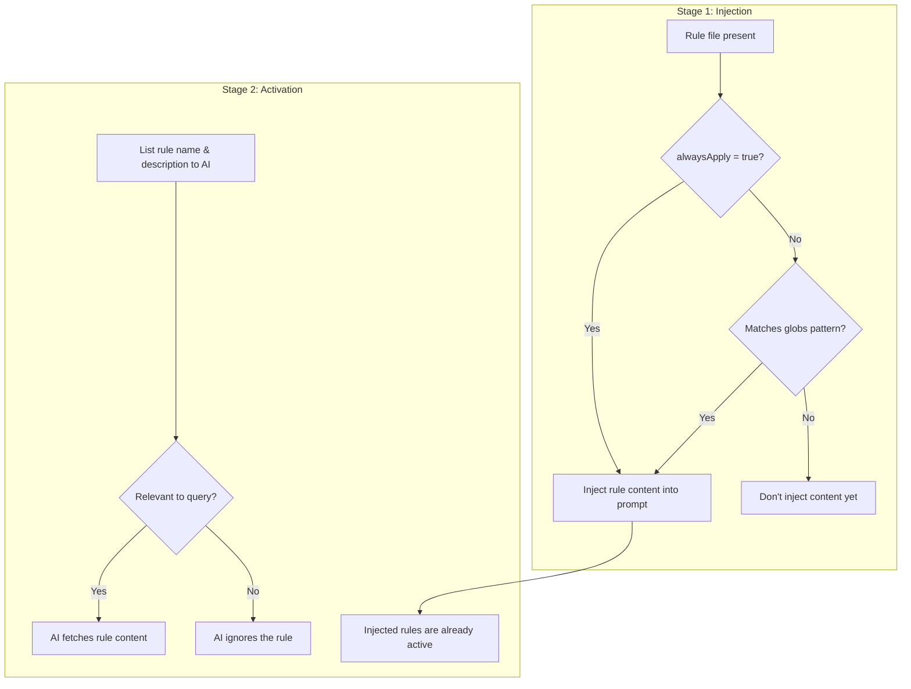

# Cursor Rules System

Cursor (v0.50+, May 2025) uses Markdown files with YAML front-matter (`.mdc` extension) organized in rules directories to guide the AI assistant, providing persistent context and instructions that shape the assistant's behavior.

## Key Features

- **Rule Types:** Always Apply, Auto-Attached (via globs), Agent-Requested, Manual
- **Nested Rules:** Supports `.cursor/rules/` directories in subdirectories (v0.50+)
- **Prompt Integration:** Shows which rules are active in the context panel
- **YAML Front-matter:** Controls rule behavior with structured metadata
- **UI Integration:** Rules can be managed directly from the Cursor interface
- **File Referencing:** Supports `@filename` syntax to include external file content
- **Character Limits:** Recommended to keep each rule under ~500 lines for optimal performance

## Canonical Locations & Precedence

Cursor loads rules from both global and project-specific locations:

```text
Cursor Settings > "Rules for AI"          # Global user preferences
<repo-root>/.cursor/rules/*.mdc           # Project-specific rules
<repo>/<subdirectory>/.cursor/rules/*.mdc # Nested module rules (subdirectory-specific)
(legacy) <repo>/.cursorrules              # Single-file fallback (deprecated but supported)
```

## Directory Structure Example

```text
project/
├── .cursor/                       # Project root rules
│   └── rules/
│       ├── always-style.mdc        # alwaysApply: true in YAML front-matter
│       └── api-conventions.mdc     # globs: ["**/api/**"] in YAML front-matter
├── frontend/
│   ├── .cursor/                  # Subdirectory-specific rules
│   │   └── rules/
│   │       └── react-standards.mdc  # Only loaded when working in frontend/
└── ...
```

## YAML Front-matter Configuration

Cursor uses a YAML front-matter block to configure rules:

```markdown
---
description: React Component Standards  
globs: ["**/components/**/*.tsx"]
alwaysApply: false
---
# React Component Guidelines
- Use functional components with hooks
- Follow naming pattern: ComponentName.tsx
```

| Field | Purpose | Example |
|-------|---------|---------|
| `alwaysApply` | Whether rule is automatically included in all contexts | `alwaysApply: true` |
| `description` | One-sentence summary of the rule's purpose | `description: "Database Schema"` |
| `globs` | Path patterns for automatic rule activation | `globs: ["**/*.py", "**/*.ipynb"]` |

## Activation Modes

Cursor offers four ways to activate rules:

1. **Always Apply**: Rules that are always included in context for every operation
   - Best for critical project information, style guides, and core concepts
   - Use sparingly to avoid using up the context token limit
   ```yaml
   ---
   alwaysApply: true
   ---
   ```

2. **Auto-Attached**: Rules that apply only when working with matching files
   - Perfect for language-specific or framework-specific guidance
   - Requires `globs` field to specify file patterns
   ```yaml
   ---
   globs: ["**/*.py", "**/*.ipynb"]
   ---
   ```

3. **Agent-Requested**: Rules that are only added when the AI specifically requests them
   - Useful for reference material that may or may not be needed
   - Requires `description` field for the AI to determine relevance
   ```yaml
   ---
   description: "Database Schema"
   ---
   ```

4. **Manual**: Rules that are only applied when manually selected by the user
   - For specialized knowledge that's only occasionally needed
   ```yaml
   ---
   # No special metadata - will only be used when explicitly referenced
   ---
   ```

## File Structure Example

```markdown
---
description: React Component Standards
globs: ["**/components/**/*.tsx"]
alwaysApply: false
---

# React Component Guidelines

- Use functional components with hooks
- Follow naming pattern: ComponentName.tsx
- Implement error boundaries
```

## Nested Rules Feature (v0.50+, May 2025)

Cursor supports nested rule directories with automatic scoping:

- Place `.cursor/rules/` folders anywhere in your project tree
- Rules are loaded based on file relevance:
  - Root-level rules always checked first
  - Subdirectory rules only loaded when working with files in that path
  - Deeper nested rules triggered only when their specific files are involved



## File Referencing

Use `@filename` syntax to include external file content:

```markdown
# React Component Guidelines

@templates/component-template.tsx

# Additional Guidelines
- Always include PropTypes
- Add JSDoc comments for all props
```

## Character Limits

Cursor implements character limits to prevent context overload:

- **~500 lines per rule file**: Encourages concise, focused content
- **UI indication**: Shows when the rule is approaching limits

## Rule Content and Capabilities

Rules can contain various types of guidance:

| Type | Purpose | Example |
|------|---------|---------|
| **Coding Style Guides** | Naming conventions, formatting rules | Style guides, naming patterns |
| **Architecture Decisions** | Project structure, design patterns | Technology choices, patterns |
| **Boilerplate Templates** | Common code structures | Component templates, file skeletons |
| **Workflow Instructions** | Step-by-step procedures | Deployment processes, review steps |
| **Testing Checklists** | Quality criteria | Test coverage requirements |
| **Knowledge Base** | Domain concepts, framework help | API explanations, domain models |

## Loading Process

When working with files in Cursor, the rules are processed as follows:

1. Load global user preferences (from Cursor settings)
2. Load all "Always Apply" rules from the root `.cursor/rules/` directory
3. Check file paths against glob patterns for "Auto-Attached" rules
4. If working in a subdirectory with a `.cursor/rules/` folder, load applicable rules
5. Add any manually selected rules
6. Merge all applicable rules into the context (with precedence for more specific rules)



## UI Integration

Cursor provides a dedicated UI for managing rules:

- **Creating Rules:** Use Command Palette (Cmd + Shift + P) > "New Cursor Rule"
- **Viewing/Editing:** Access in Cursor Settings > Project Rules, or edit `.mdc` files directly
- **Version Control:** Commit rule files to your repository for team sharing
- **Updates:** Changes to rules apply to new conversations (not retroactively to ongoing chats)
- **Generating Rules:** Ask the AI to "/Generate Cursor Rules" from a conversation

## Best Practices for Cursor Rules

- **One concern per file**: Keep rules small and focused
- **Use proper description and globs in front-matter**: Help both users and the AI understand when rules apply
- **Keep critical always-apply rules at the root level**: Put common patterns in the main rules directory
- **Limit nesting to 2-3 levels for maintainability**: Too deep of a structure becomes hard to manage
- **Use for domain-specific guidance in monorepos**: Particularly effective for projects with multiple technologies
- **Be specific and actionable**: Provide concrete examples rather than vague advice
- **Keep rules updated**: Review and revise rules as your project evolves
- **Avoid redundancy and contradictions**: Ensure rules don't duplicate or conflict with each other
- **Test your rules incrementally**: Verify the AI follows your guidance after adding or changing rules

## Best Practices for Nested Rules

- **Follow component architecture**: Align rule structure with your codebase organization
- **Create technology-specific rules**: e.g., React conventions in frontend directory, Python conventions in API directory
- **Document rule locations**: Include a rules index in your project README or developer documentation
- **Regularly audit and update**: Remove outdated rules and ensure content stays relevant
- **Prefer globs over always-apply for subdirectories**: More precise control over when rules are loaded

## Limitations & Considerations

- **No Native Templating Language:** The `.mdc` format doesn't support dynamic placeholders
- **Glob Pattern Limitations:** Brace expansion (e.g., `{ts,tsx}`) is not supported
- **Dynamic Updates:** Rule changes only apply to new conversations, not ongoing ones
- **No Cross-Project Rules Linking:** Each project's rules are isolated to that project
- **Rules Only Guide, Not Dictate:** The AI might still occasionally produce output that doesn't follow a rule

## Version Information

| Aspect | Details |
|--------|---------|
| Last-verified release | v0.50.0 (May 2025) |
| Primary docs | Cursor documentation website |
| Front-matter specification | Updated in v0.50 (May 2025) |

## Mixdown Integration

> [!NOTE]
> 🚧 Pending Mixdown integration