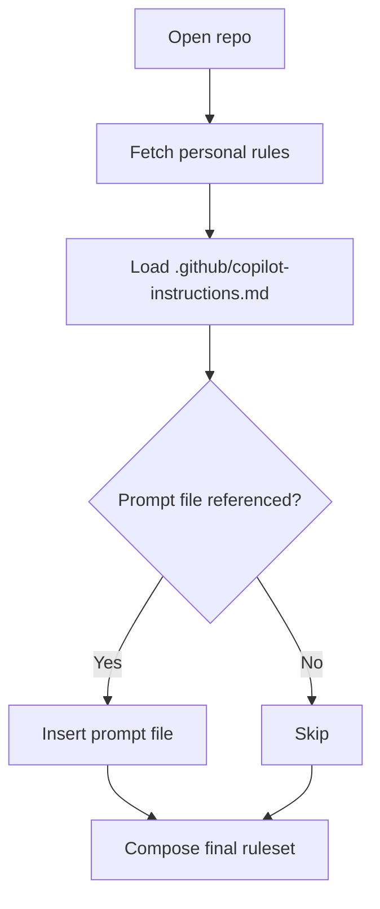

# GitHub Copilot Rules System

GitHub Copilot (build 6c3e9e6, May 2025) accepts natural-language rules written in Markdown to steer Copilot Chat, Copilot Coding Agent, and related modes. Rules can be set globally or per-repository via a special file, and are automatically injected into every Copilot request for that scope.

## Key Features

- **File Format:** Plain-text Markdown (`.md`) with no front-matter or special syntax
- **Scoping Mechanisms:** Personal (global), repository-level, and prompt files
- **Activation Method:** Loaded automatically when you open a repository
- **Integration:** Native support in VS Code, Visual Studio 2022 17.14+, and github.com
- **Rule Types:** Ask Mode, Edit Mode, Agent Mode/Coding Agent
- **File References:** None; references other standard GitHub information like issues
- **Character Limits:** No explicit limit, but recommended to keep under ~600 tokens

## Canonical Locations & Precedence

GitHub Copilot loads rules from both global and repository-specific locations:

```text
GitHub Profile → Custom Instructions       # Personal rules (set via GitHub UI)
<repo-root>/.github/copilot-instructions.md  # Repository-specific rules
<repo-root>/prompts/*.prompt.md           # Optional prompt files (VS Code only)
```

Order of application (highest → lowest): Personal UI settings → Prompt file (when invoked) → Repository instructions. If conflicts arise, later injections overwrite earlier lines in the final prompt.

## Directory Structure Example

```text
my-project/
├── .github/
│   └── copilot-instructions.md
└── prompts/
    ├── new-feature.prompt.md
    └── api-security-review.prompt.md
```

## File Structure Example

```markdown
# Repository Custom Instructions

Use Bazel for Java dependencies.  
Always format JavaScript with double quotes and tabs.  
Reference Jira issue keys (e.g., JIRA-123) in commit messages.
```

## Activation Mechanisms

GitHub Copilot uses a straightforward activation process:

1. **Automatic Loading**: Rules are loaded when you open a repository containing the file
   - Personal rules are fetched from GitHub
   - Repository rules are read from `.github/copilot-instructions.md`
   - Both are automatically included in every prompt

2. **Prompt Files**: Only activated when explicitly referenced
   - Use `/prompt <filename>` in VS Code Chat to include
   - Perfect for task-specific instructions

3. **Dynamic Updates**: Changes to rules files are hot-reloaded
   - Saving the instructions file triggers a refresh
   - Existing chat threads get a banner to refresh context



## Rule Content Types

GitHub Copilot rules can include various types of guidance:

| Type | Purpose | Example |
|------|---------|---------|
| **Project Context** | Tooling, frameworks, directory conventions | "Use pnpm for all Node package management" |
| **Coding Standards** | Style guides, formatting, banned APIs | "Always format JavaScript with double quotes" |
| **Workflow Guidelines** | Branch naming, PR processes | "Reference Jira issue keys in commit messages" |
| **Tooling Notes** | CLI preferences, configurations | "Run `pnpm test` before every commit" |

## Character Limits

GitHub Copilot implements soft character limits:

- **No explicit limit**: No hard constraint in documentation
- **~600 tokens recommended**: Community reports suggest keeping under this threshold
- **Silent truncation**: Very long rules files may be truncated without notice

## Loading Process

When working with Copilot, the rules are processed as follows:

1. Open repository in IDE or github.com
2. Copilot extension scans for `.github/copilot-instructions.md`
3. Personal UI rules are fetched from GitHub
4. Combined prompt is cached for the session
5. Prompt files are injected only when referenced

## Best Practices for Copilot Rules

- **Be specific:** Short imperative statements work better than narrative prose
- **Use structure:** Group related points; keep ≤ 1-2 lines each
- **Update regularly:** Revisit after major refactors; prune obsolete rules
- **Avoid secrets:** Never include tokens or passwords; file is plaintext
- **Test iteratively:** Chat "What repo rules are active?" to confirm Copilot's view
- **Stay concise:** Keep instructions focused to prevent truncation
- **Prioritize clarity:** Each line should contain a single, unambiguous instruction
- **Use consistent style:** Maintain uniform formatting throughout your rules
- **Focus on principles:** Teach Copilot your "why" not just your "how"

## Limitations & Considerations

- **File size:** Long rules files may be truncated without notice
- **Rule conflicts:** No formal conflict-resolution UI; ambiguous guidance may lower answer quality
- **Model capabilities:** Instructions influence style but cannot force using libraries that contradict training
- **Security:** File content is sent to GitHub's servers and the underlying LLM
- **No templating:** No support for dynamic content or variables in rules files
- **Limited feedback:** No UI shows which rules are actively influencing responses
- **Command triggers:** Special commands in VS Code may override certain rule aspects

## Version Information

| Aspect | Details |
|--------|---------|
| Last-verified version | Copilot Docs build 6c3e9e6 (2025-05-19) |
| Documentation sources | GitHub Docs articles on repository instructions, personal instructions, prompt files |
| Staleness warning | None – all sources ≤ 1 week old |

## Mixdown Integration

> [!NOTE]
> 🚧 Pending Mixdown integration