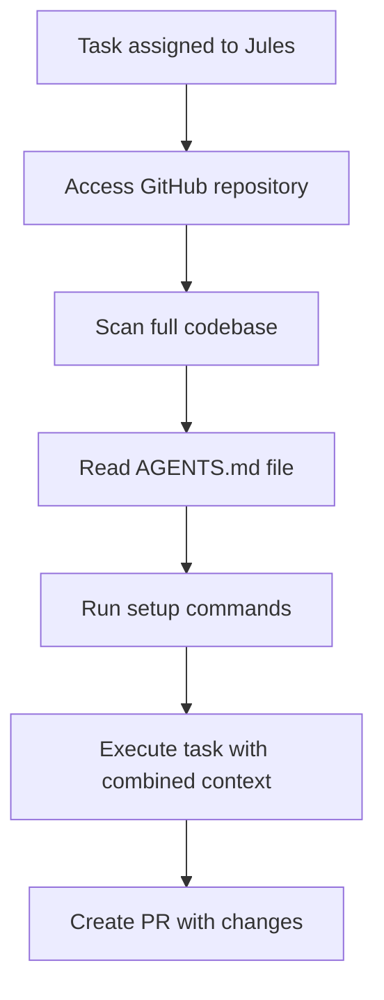

# Google Jules Rules System

Google Jules (v1.2+, May 2025) uses a simple configuration-based approach centered around an `AGENTS.md` file in your repository root to help the AI understand your project structure, conventions, and workflows.

## Key Features

- **Rule Types:** Single configuration file approach (no complex rule types)
- **Scoping Mechanisms:** Repository-wide configuration with project-specific context
- **File Format:** Plain Markdown with no front-matter required
- **Prompt Integration:** Full codebase context combined with AGENTS.md instructions
- **UI Integration:** Web-based interface with GitHub integration
- **File Referencing:** Not supported (reads entire codebase automatically)
- **Character Limits:** No hard limits (recommended to keep concise for optimal performance)

## Canonical Locations & Precedence

Google Jules loads configuration from a single, simple location:

```text
<repo-root>/AGENTS.md                   # Primary configuration file
<repo-root>/[setup-commands]            # Optional environment setup scripts
```

Order of application: Jules reads the entire codebase for context, then applies AGENTS.md guidance as overriding instructions.

## Directory Structure Example

```text
project/
├── AGENTS.md                          # Main configuration file
├── src/                               # Application code (auto-discovered)
│   ├── components/
│   └── utils/
├── tests/                             # Test files (auto-discovered)
├── package.json                       # Dependencies (auto-analyzed)
└── README.md                          # Project documentation (auto-read)
```

## YAML Front-matter Configuration

Google Jules uses plain Markdown without YAML front-matter:

```markdown
# My Project Agents and Tools

## Project Overview

This is a TypeScript React application using Next.js and Tailwind CSS.

## Coding Standards

- Use TypeScript for all new code
- Follow Biome configuration
- Use Prettier for formatting
- Conventional commits for Git messages

## Architecture

- Components in src/components/
- Utilities in src/utils/
- API routes in pages/api/
- Tests co-located with source files
```

No front-matter configuration is required or supported - Jules uses plain Markdown content.

## Activation Modes

Google Jules offers 1 primary activation mode:

1. **Repository Context**: Automatic activation when working on any file in the repository

   - Always applies AGENTS.md guidance to all tasks
   - Combines with full codebase understanding
   - No manual activation required

   ```markdown
   # Project Configuration

   Your instructions and context here...
   ```

## File Structure Example

```markdown
# Project Agents and Development Guidelines

## Project Overview

This is a full-stack TypeScript application with React frontend and Node.js backend.

## Technology Stack

- Frontend: React 18, Next.js 14, Tailwind CSS
- Backend: Node.js, Express, PostgreSQL
- Testing: Jest, React Testing Library
- Deployment: Vercel (frontend), Railway (backend)

## Coding Standards

- Use TypeScript strict mode
- Follow Biome configuration
- Implement proper error handling
- Write unit tests for business logic
- Use meaningful variable and function names

## Project Structure

- `/src/components/` - Reusable React components
- `/src/pages/` - Next.js pages and API routes
- `/src/utils/` - Utility functions and helpers
- `/src/types/` - TypeScript type definitions
- `/tests/` - Test files (unit and integration)

## Development Workflow

1. Create feature branch from main
2. Implement changes with tests
3. Run `bun run build` and `bun run test` before committing
4. Use conventional commit messages
5. Create PR with description and testing notes

## Testing Requirements

- Unit tests for all utility functions
- Component tests for complex UI logic
- API endpoint tests for backend routes
- Minimum 80% code coverage
- All tests must pass before merging

## Deployment Process

- Frontend deploys automatically on merge to main
- Backend requires manual deployment approval
- Environment variables managed through platform dashboards
- Database migrations run automatically
```

## File Referencing

Google Jules does not support external file referencing. Instead, it automatically reads and understands your entire codebase context, making manual file inclusion unnecessary.

```markdown
# Project Guidelines

## Codebase Context

Jules automatically reads all project files including:

- Source code files
- Configuration files (package.json, tsconfig.json, etc.)
- Documentation (README.md, docs/)
- Test files
- CI/CD configuration

No manual file referencing is needed.
```

## Character Limits

Google Jules implements no hard character limits for AGENTS.md:

- **No character limit per file**: AGENTS.md can be any length
- **Performance consideration**: Shorter, focused instructions work better
- **No UI indication**: No limit warnings (keep concise for best results)

## Rule Content and Capabilities

AGENTS.md can contain various types of guidance:

| Type                       | Purpose                              | Example                           |
| -------------------------- | ------------------------------------ | --------------------------------- |
| **Project Overview**       | High-level context and purpose       | Technology stack, project goals   |
| **Coding Standards**       | Naming conventions, formatting rules | TypeScript rules, linting setup   |
| **Architecture Decisions** | Project structure, design patterns   | Directory structure, data flow    |
| **Development Workflow**   | Step-by-step procedures              | Git workflow, testing process     |
| **Testing Guidelines**     | Quality criteria and requirements    | Coverage requirements, test types |
| **Deployment Process**     | Release and deployment steps         | Build process, environment setup  |

## Loading Process

When working with Google Jules, the configuration is processed as follows:

1. Jules accesses the connected GitHub repository
2. Scans entire codebase for context and understanding
3. Reads AGENTS.md file for specific project guidance
4. Combines codebase analysis with AGENTS.md instructions
5. Executes setup commands in isolated VM environment
6. Applies combined context to task execution



## UI Integration

Google Jules provides a web-based interface for managing projects:

- **Creating Configuration:** Edit AGENTS.md directly in GitHub or through Jules interface
- **Viewing/Editing:** Changes to AGENTS.md take effect immediately
- **Version Control:** AGENTS.md is committed to repository like any other file
- **Updates:** Changes apply to subsequent tasks automatically
- **Task Management:** Web dashboard shows task progress and results

## Best Practices for Google Jules Rules

- **Be Specific About Context**: Clearly describe what your project does and its architecture
- **Include Technology Stack**: List frameworks, libraries, and tools used
- **Define Coding Standards**: Specify linting rules, formatting preferences, and conventions
- **Explain Project Structure**: Describe directory organization and file purposes
- **Document Workflows**: Include development, testing, and deployment processes
- **Keep Instructions Clear**: Use simple, direct language that's easy to understand
- **Update Regularly**: Keep AGENTS.md current with project evolution
- **Focus on What's Unique**: Emphasize project-specific patterns and requirements

## Limitations & Considerations

- **Single File Configuration**: All instructions must fit in one AGENTS.md file
- **No Nested Rules**: Cannot create directory-specific or file-specific rules
- **GitHub Dependency**: Requires GitHub repository integration
- **Cloud Execution**: All tasks run in Google's VM environment, not locally
- **Language Support**: Best support for JavaScript/TypeScript and Python projects
- **Beta Limitations**: Currently 5 tasks per day during public beta

## Version Information

| Aspect                      | Details                            |
| --------------------------- | ---------------------------------- |
| Last-verified release       | v1.2.0 (May 2025)                  |
| Primary docs                | Google Jules documentation website |
| Configuration specification | AGENTS.md format established v1.0  |

## Rulesets Integration

> [!NOTE]
> 🚧 Pending Rulesets integration
