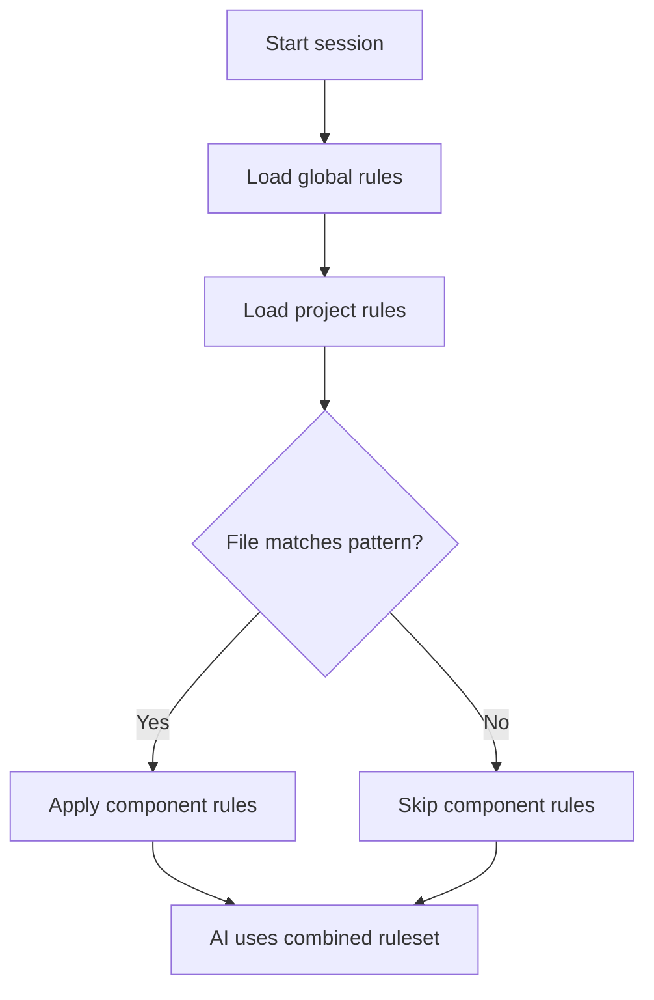

# [Provider Name] Rules System

[Provider Name] (vX.Y+, Month YYYY) uses [brief description of how this provider implements AI instructions/rules in 1-3 sentences].

## Key Features

- **Rule Types:** [e.g., Always Apply, Auto-Attached, Model-Decision, Manual]
- **Scoping Mechanisms:** [e.g., global, project-level, directory-specific]
- **File Format:** [e.g., Markdown with YAML front-matter, plain Markdown]
- **Prompt Integration:** [how rules appear in the context/prompt]
- **UI Integration:** [how rules are managed through provider interface]
- **File Referencing:** [any file inclusion syntax if supported]
- **Character Limits:** [any size or token limits for rules files]

## Canonical Locations & Precedence

[Provider Name] loads rules from both global and project-specific locations:

```text
~/.config/[provider]/rules.md         # Global user preferences
<repo-root>/.[provider]/rules/*.md    # Project-specific rules
<repo>/<subdirectory>/.[provider]/*.md # Nested module rules (if supported)
(legacy) <repo>/.providerrules        # Single-file fallback (if applicable)
```

Order of application: [describe precedence order and conflict resolution].

## Directory Structure Example

```text
project/
├── .[provider]/                      # Project root rules
│   └── rules/
│       ├── always-on-style.md        # Always-on rules example
│       └── api-conventions.md        # Auto-attached example
├── submodule/
│   ├── .[provider]/                  # Subdirectory-specific rules (if supported)
│   │   └── rules/
│   │       └── submodule-standards.md
└── ...
```

## YAML Front-matter Configuration

[Provider Name] uses a YAML front-matter block to configure rules:

```markdown
---
description: "Example rule description"
globs: ["**/*.{js,ts}"]
activation: "always_on"
---
# Rule Title

- Rule content here
```

| Field | Purpose | Example |
|-------|---------|---------|
| `activation` | How the rule is activated | `activation: "always_on"` |
| `description` | Summary of the rule's purpose | `description: "Database Schema"` |
| `globs` | Path patterns for automatic activation | `globs: ["**/*.py", "**/*.ipynb"]` |
| [other fields] | [their purpose] | [example value] |

## Activation Modes

[Provider Name] offers [number] ways to activate rules:

1. **[Mode 1]**: [Description of activation mode]
   - [When to use this mode]
   - [Requirements for this mode]
   ```yaml
   ---
   activation: "mode1"
   ---
   ```

2. **[Mode 2]**: [Description of activation mode]
   - [When to use this mode]
   - [Requirements for this mode]
   ```yaml
   ---
   activation: "mode2"
   ---
   ```

## File Structure Example

```markdown
---
description: "Example rule file"
globs: ["**/*.{js,ts}"]
activation: "always_on"
---

# [Category] Standards

- [Rule 1]
- [Rule 2]
- [Rule 3]

# Additional Guidelines

- [Guideline 1]
- [Guideline 2]
```

## File Referencing

[If applicable, describe how to include external file content]

```markdown
# [Category] Guidelines

@[path/to/file.ext]

# Additional Guidelines
- [Guideline 1]
- [Guideline 2]
```

## Character Limits

[Provider Name] implements character limits to prevent context overload:

- **[X] characters per rule file**: [Implications]
- **[Y] characters total across all rules**: [Implications]
- **UI indication**: [How limits are displayed]

## Rule Content and Capabilities

Rules can contain various types of guidance:

| Type | Purpose | Example |
|------|---------|---------|
| **Coding Style Guides** | Naming conventions, formatting rules | Style guides, naming patterns |
| **Architecture Decisions** | Project structure, design patterns | Technology choices, patterns |
| **Boilerplate Templates** | Common code structures | Component templates, file skeletons |
| **Workflow Instructions** | Step-by-step procedures | Deployment processes, review steps |
| **Testing Checklists** | Quality criteria | Test coverage requirements |
| **Knowledge Base** | Domain concepts, framework help | API explanations, domain models |

## Loading Process

When working with [Provider Name], the rules are processed as follows:

1. [Step 1 of loading process]
2. [Step 2 of loading process]
3. [Step 3 of loading process]
4. [Step 4 of loading process]



## UI Integration

[Provider Name] provides a dedicated UI for managing rules:

- **Creating Rules:** [How to create new rules]
- **Viewing/Editing:** [How to view and edit existing rules]
- **Version Control:** [How rules integrate with version control]
- **Updates:** [How rule changes are applied]
- **Generating Rules:** [Any automated rule generation features]

## Best Practices for [Provider Name] Rules

- **[Best Practice 1]**: [Description and explanation]
- **[Best Practice 2]**: [Description and explanation]
- **[Best Practice 3]**: [Description and explanation]
- **[Best Practice 4]**: [Description and explanation]
- **[Best Practice 5]**: [Description and explanation]
- **[Best Practice 6]**: [Description and explanation]
- **[Best Practice 7]**: [Description and explanation]
- **[Best Practice 8]**: [Description and explanation]

## Limitations & Considerations

- **[Limitation 1]:** [Description and implications]
- **[Limitation 2]:** [Description and implications]
- **[Limitation 3]:** [Description and implications]
- **[Limitation 4]:** [Description and implications]
- **[Limitation 5]:** [Description and implications]

## Version Information

| Aspect | Details |
|--------|---------|
| Last-verified release | vX.Y.Z (Month YYYY) |
| Primary docs | [Provider Name] documentation website |
| Front-matter specification | Updated in vX.Y (Month YYYY) |

## Mixdown Integration

> [!NOTE]
> 🚧 Pending Mixdown integration