# Windsurf Rules System

Windsurf (v1.9+, May 2025) uses a flexible folder-based rules system with multiple activation modes for fine-grained control over when rules are applied. Windsurf's rules provide persistent context to Cascade—the in-IDE AI agent—before every reply.

## Key Features

- **Activation Modes:** Four trigger types: `always_on`, `glob`, `model_decision`, `manual`
- **YAML-ish Front-matter:** Required configuration with explicit trigger field
- **Character Limits:** 6K per file, 12K total across all rules
- **UI Integration:** Rules can be toggled and edited through the Windsurf UI
- **File References:** Supports `@relative/path.ext` syntax to include file contents
- **Integration:** Works alongside Cascade Memories and Workflows

## Canonical Locations & Precedence

Windsurf loads rules from both global and project-specific locations:

```text
~/.config/windsurf/global_rules.md       # Global user preferences
<repo-root>/.windsurf/rules/*.md         # Project-specific rules
<repo>/<sub>/.windsurf/rules/*.md        # Nested module rules (subdirectory-specific)
(legacy) <repo>/.windsurfrules           # Single-file fallback (deprecated)
```

Rules from all scopes are merged, with the LLM reconciling any conflicts.

## Directory Structure Example

```text
my-app/
├── .windsurf/
│   └── rules/
│       ├── global-guidelines.md        # trigger: always_on
│       └── api-style.md                # trigger: glob | globs: "src/server/**/*.ts"
├── frontend/
│   └── .windsurf/rules/ui.md           # module rule
└── ~/.config/windsurf/global_rules.md  # user scope (outside repo)
```

## Front-matter Configuration (v1.9)

Windsurf uses a YAML-ish front-matter block to configure rules:

```markdown
---
trigger: model_decision
description: "Testing guidelines for all *.test.tsx files"
globs: "**/*.test.ts?(x)"
---
```

| Field | Purpose | Example |
|-------|---------|---------|
| `trigger` | **Required** enum: `always_on`, `glob`, `model_decision`, `manual` | `trigger: model_decision` |
| `description` | One-sentence summary (mandatory for `model_decision`) | `description: Guidelines for Flask apps` |
| `globs` | Path patterns used when `trigger: glob` | `globs: "**/*.py"` |
| `name` *(optional)* | Friendly label for UI listing | `name: API Standards` |

**Note:** The `alwaysApply` field is deprecated and replaced by `trigger`. Old files still work but generate lint warnings.

## Activation Modes

Windsurf's distinctive feature is its four activation modes (via the `trigger` field):

1. **always_on**: Rules are included in every prompt
   - Best for critical project information, style guides, and core concepts
   - Use sparingly to avoid using up the context token limit

2. **glob**: Rules are included when the edited/mentioned file matches glob patterns
   - Perfect for language-specific or framework-specific guidance
   - Requires `globs` field to specify file patterns
   - Example: `globs: "**/*.tsx"` for React components

3. **model_decision**: The AI decides whether to include the rule based on relevance
   - Useful for reference material that may or may not be needed
   - Requires `description` field for the AI to determine relevance
   - Reduces prompt engineer work by delegating to the AI

4. **manual**: Rules are only included when explicitly referenced by name
   - Activated only when the user types `@rule-name`
   - Good for specialized knowledge that's only occasionally needed
   - Helps manage context size by keeping rarely-needed information out by default

## File Structure Example

```markdown
---
trigger: model_decision
description: "Testing guidelines for all *.test.tsx files"
globs: "**/*.test.ts?(x)"
---

# Unit-Test Standards

- Use **Vitest** + `setupTests.ts`
- Mock APIs with **msw**
- Keep each test under 100 LOC
```

## File Referencing

Use `@relative/path.ext` syntax to include external file content:

```markdown
# React Component Guidelines

@templates/component-template.tsx

# Additional Guidelines
- Always include PropTypes
- Add JSDoc comments for all props
```

## Character Limits

Windsurf implements strict character limits to prevent context overload:

- **6K characters per rule file**: Encourages concise, focused content
- **12K characters total across all rules**: Forces prioritization of the most important guidance
- **UI indication**: Shows character count and warns when approaching limits

## Loading Process

When Cascade processes a prompt, rules are loaded as follows:

1. Inject every rule with `trigger: always_on`, plus any `trigger: glob` that matches the current file context
2. Present remaining rules (name + description) for the model to decide which to include
3. The model fetches full content for relevant `model_decision` rules
4. Manual rules are only activated when explicitly mentioned with `@rule-name`

```mermaid
flowchart TD
    A[Start prompt] --> B[Inject always_on & matching glob rules]
    B --> C[List remaining rules]
    C --> D{Relevant?}
    D --Yes--> E[fetch_rules → inject]
    D --No--> F[ignore]
```



## UI Integration

Windsurf provides a dedicated UI for managing rules:

- Toggle rules on/off in real-time
- Edit rules directly within the interface
- Sort rules to control loading priority
- Visual indicators for which rules are currently active
- Character count indicators

## Best Practices for Windsurf Rules

- **Use the new trigger field**: Keep `alwaysApply` only for backward compatibility
- **One theme per file**: Stay under 6K chars by splitting large docs into targeted rules
- **Start descriptions with explicit cues**: For example, "USE WHEN writing SQL migrations" helps the model's relevance check
- **Combine trigger and globs**: Use `trigger: glob` with `globs: "pattern"` for file-specific rules
- **Enumerate extensions explicitly**: Use `*.ts`, `*.tsx` since brace expansion isn't supported
- **Prioritize with naming conventions**: Use prefixes like "01-", "02-" to control loading order
- **Select appropriate activation modes**: Match the mode to the rule's purpose and frequency of use
- **Use descriptive filenames**: Make it easy to understand rule content from the filename alone
- **Regularly audit active rules**: Check which rules are active to avoid context bloat
- **Prefer model_decision over always_on**: Reduce token pressure by letting the AI fetch only when needed
- **Version control rules**: Treat rule changes like code changes and review them

## Limitations & Considerations

- **Token pressure**: Long rules consume context; prefer `model_decision` rules to load only when needed
- **Live edits**: Require a new Cascade conversation or app reload to take effect
- **Security**: Rules are sent to Windsurf's backend LLMs—avoid including secrets
- **Legacy support**: Single `.windsurfrules` still works but lacks front-matter and trigger support
- **Subdirectory rules**: For monorepos, consider nested rules for different project areas

## Version Information

| Aspect | Details |
|--------|---------|
| Last-verified release | v1.9.0 (May 15, 2025) |
| Primary docs & changelog | Windsurf changelog (May 2025) |
| Front-matter specification | Updated in v1.9 (May 2025) |

## Mixdown Integration

> [!NOTE]
> 🚧 Pending Mixdown integration