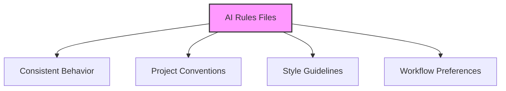
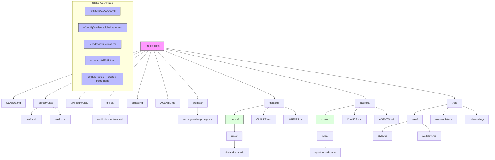
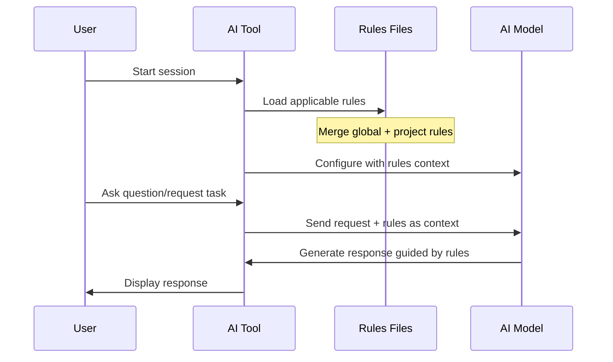
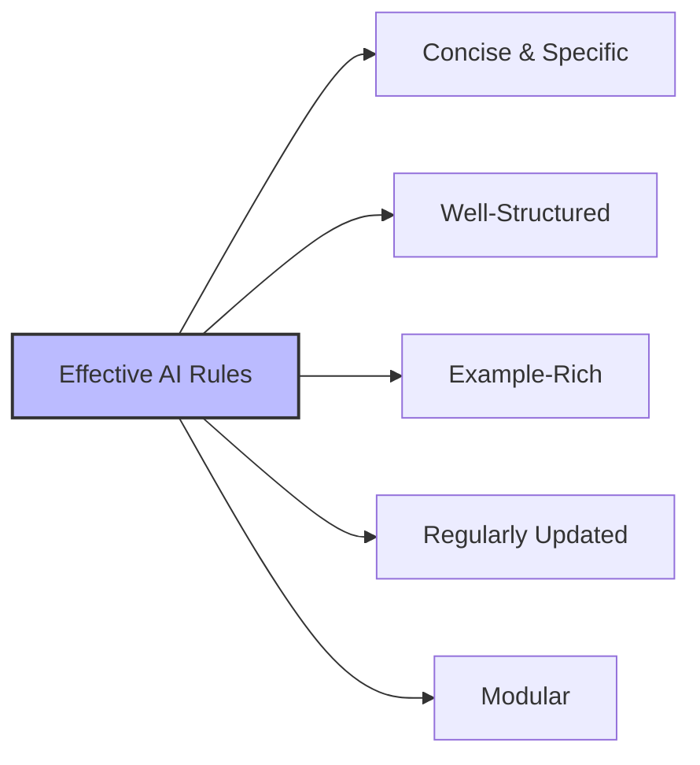
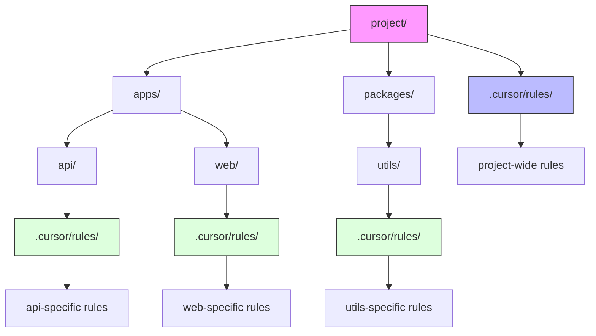
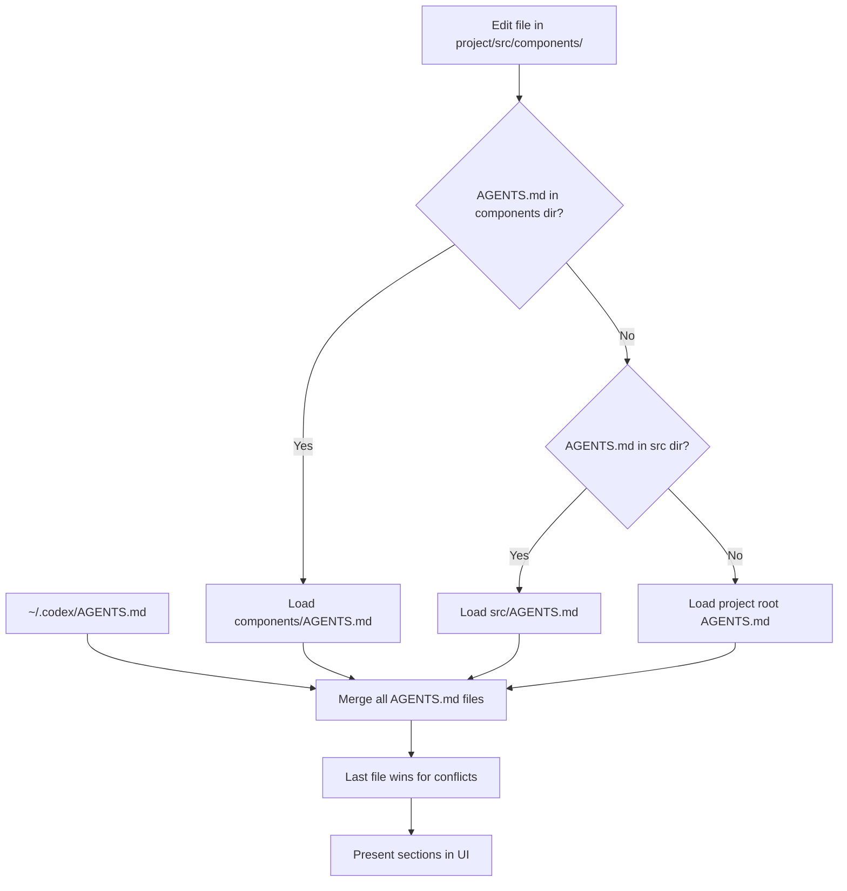
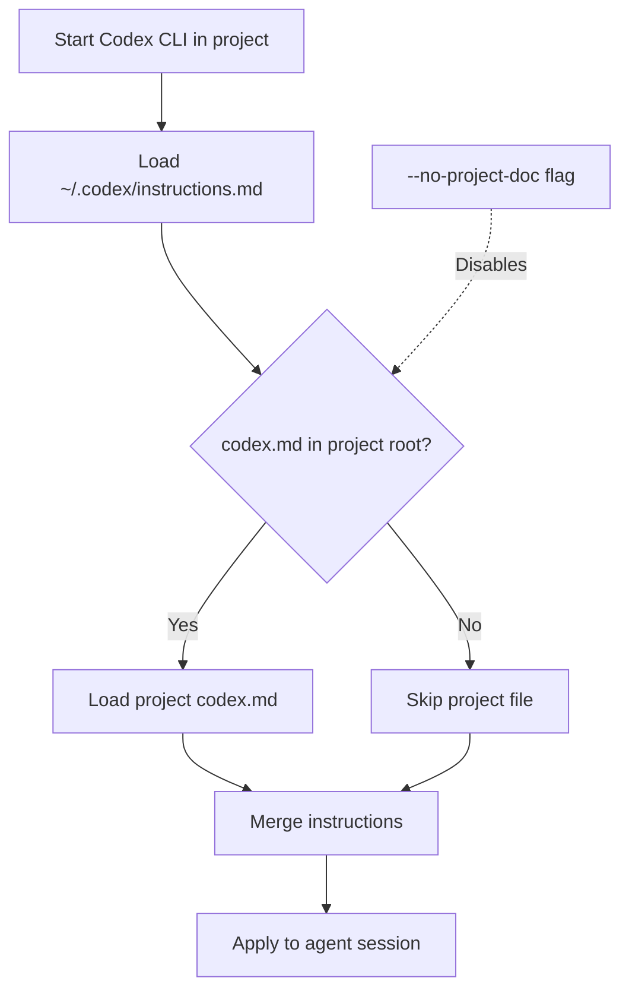
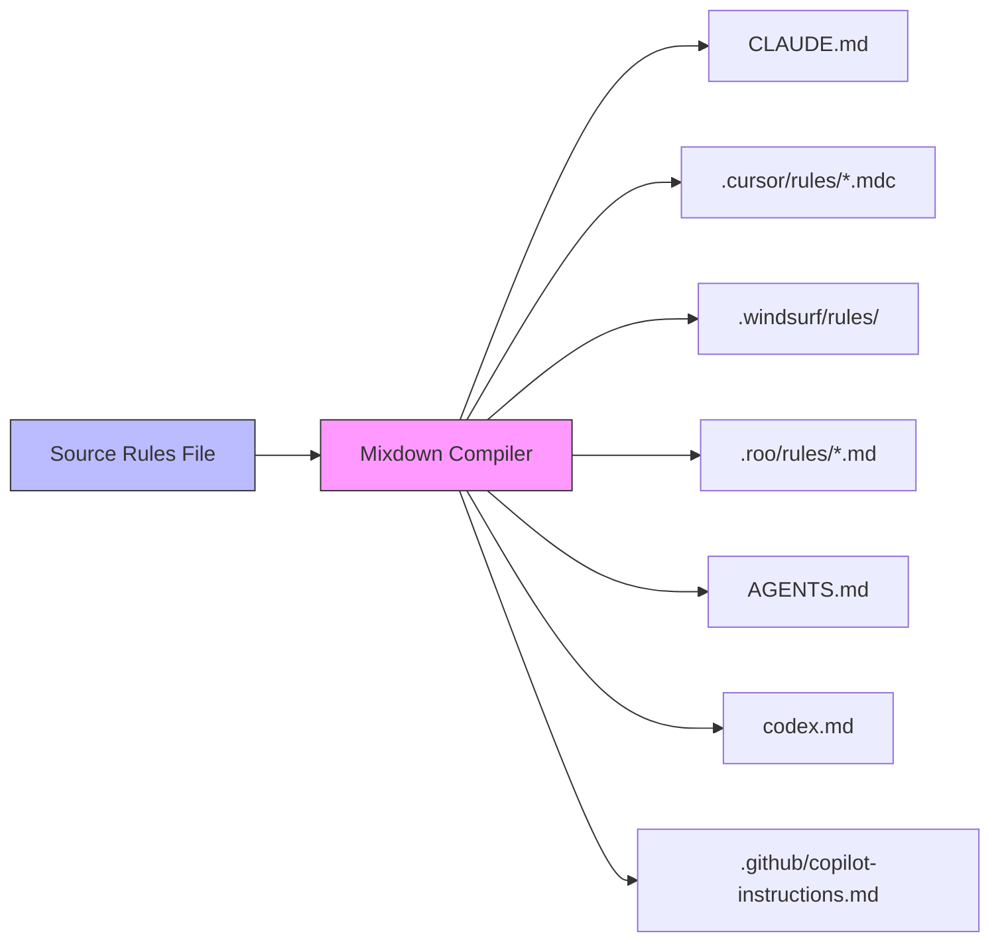
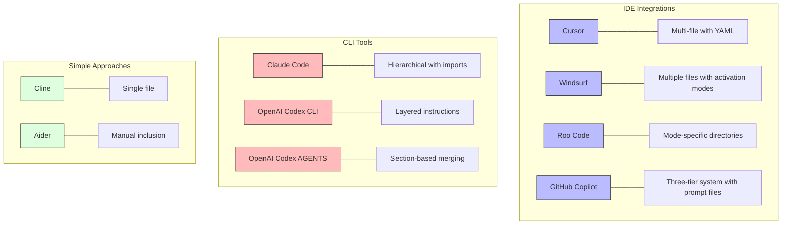

# AI Rules Guide

This guide explains how AI coding assistants use persistent instruction files (often called "rules" or "memory" files) to maintain consistent behavior across sessions and projects.

- [AI Rules Overview](#ai-rules-overview)
    - [What are AI Rules Files?](#what-are-ai-rules-files)
    - [Where Rules Files Live](#where-rules-files-live)
    - [Directory Structure Comparison](#directory-structure-comparison)
- [How Rules Work Across Tools](#how-rules-work-across-tools)
    - [Common Patterns](#common-patterns)
- [Best Practices for AI Rules](#best-practices-for-ai-rules)
- [Rule Processing](#rule-processing)
    - [Example Rule Content](#example-rule-content)
- [Token and Character Limits](#token-and-character-limits)
- [File Referencing Mechanisms](#file-referencing-mechanisms)
- [Activation Mechanisms](#activation-mechanisms)
- [UI Integration](#ui-integration)
- [Tool-Specific Implementation Details](#tool-specific-implementation-details)
    - [Cursor Rules System](#cursor-rules-system)
        - [Nested Rules Feature (v0.50+, May 2025)](#nested-rules-feature-v050-may-2025)
        - [Best Practices for Nested Rules](#best-practices-for-nested-rules)
    - [Claude Code Memory System](#claude-code-memory-system)
    - [Windsurf Rules System](#windsurf-rules-system)
    - [Roo Code Rules System](#roo-code-rules-system)
    - [OpenAI Codex AGENTS System](#openai-codex-agents-system)
    - [OpenAI Codex CLI System](#openai-codex-cli-system)
    - [Simpler Implementations](#simpler-implementations)
- [Managing Rules Across Tools](#managing-rules-across-tools)
- [Tool Comparison](#tool-comparison)
- [Key Takeaways](#key-takeaways)

## AI Rules Overview

### What are AI Rules Files?

AI rules files are special configuration files that provide consistent instructions to AI coding assistants. They serve as a "memory" that persists across sessions, ensuring the AI follows your project's conventions, style guides, and requirements.



### Where Rules Files Live

Different AI tools use different file locations and naming conventions:

| Tool | Project Rules | Global/User Rules | Format |
|------|--------------|-------------------|--------|
| **Claude Code** | `CLAUDE.md` in root and/or subdirs | `~/.claude/CLAUDE.md` | Markdown with `@file` imports |
| **Cursor** | `.cursor/rules/*.mdc` files + nested `.cursor/rules/` in subdirs (v0.50+) | User settings (UI-based) | Markdown with YAML front-matter |
| **Windsurf** | `.windsurf/rules/*.md` files (v1.9+) | `~/.config/windsurf/global_rules.md` | Markdown with activation modes (Always On, Manual, Model Decision, Glob) |
| **Roo Code** | `.roo/rules/` and `.roo/rules-{mode}/` folders | No built-in global file | Markdown files in folders |
| **OpenAI Codex CLI** | `codex.md` in root | `~/.codex/instructions.md` | Markdown text |
| **OpenAI Codex AGENTS** | `AGENTS.md` in root and/or subdirs | `~/.codex/AGENTS.md` | Pure Markdown with section headings |
| **GitHub Copilot** | `.github/copilot-instructions.md` and `prompts/*.prompt.md` | GitHub Profile → Custom Instructions | Plain-text Markdown |
| **Cline** | `.clinerules` | N/A | Plain text file |
| **Aider** | `.aider.memory.md` (needs explicit flag) | N/A | Standard Markdown |

### Directory Structure Comparison

```text
project/
├── .cursor/                       # Cursor rules directory
│   └── rules/
│       ├── coding-style.mdc        # Project-wide coding style guidelines
│       └── architecture.mdc        # Project architecture guidelines
├── .roo/                         # Roo Code rules directory 
│   ├── rules/                    # Common rules for all modes
│   │   └── coding-style.md        # Applied regardless of mode
│   │   └── terminology.md         # Project glossary and terms
│   └── rules-architect/          # Mode-specific rules
│       └── architecture.md       # System design principles
├── .windsurf/                    # Windsurf rules directory
│   └── rules/
│       ├── coding-style.md         # Coding style guidelines
│       └── architecture.md         # Architecture guidelines
├── .github/
│   └── copilot-instructions.md    # GitHub Copilot repository-level rules
├── prompts/
│   └── security-review.prompt.md  # GitHub Copilot task-specific rules
├── .clinerules                   # Cline - single project-level rules file
├── .aider.memory.md              # Aider - manually-included persistent context
├── CLAUDE.md                     # Claude Code - project memory file
├── components/                   # Project subdirectory
│   ├── .cursor/                  # Nested Cursor rules directory
│   │   └── rules/
│   │       └── component-style.mdc  # Component-specific coding style
│   ├── CLAUDE.md                 # Component-specific Claude rules
│   └── AGENTS.md                 # Component-specific Codex AGENTS rules
├── codex.md                      # OpenAI Codex CLI - project instructions
├── AGENTS.md                     # OpenAI Codex AGENTS - project rules file
└── README.md                     # Regular project files
```



## How Rules Work Across Tools

While implementation varies, the core mechanism is consistent:



### Common Patterns

1. **Layered Context:** Global rules apply to all projects, project rules override for specific projects
2. **Scoping Mechanisms:**
   - Cursor: Rule types (always, auto-attached, agent-requested, manual) + nested rules in subdirectories
   - Windsurf: Activation modes (Always On, Manual, Model Decision, Glob) with 6K char limit per file
   - Claude Code: Directory-based (subdirectory CLAUDE.md files)
   - Roo Code: Mode-specific folders (rules-{mode}/)
   - OpenAI Codex AGENTS: Directory-based loading (upward path walking) with section merging
   - GitHub Copilot: Layer-based (personal, repository, prompt files)
3. **Format:** Most use Markdown for human-readability and structure

## Best Practices for AI Rules

- Keep rules **concise and specific** (focus on actual needs, not general advice)
- Use **bullet points under clear headings** for better parsing
- Include **code examples** for concrete guidance
- Focus on areas where the AI needs direction (coding style, project architecture)
- Update rules as your project evolves
- Consider breaking large rule sets into modular files
- Avoid including sensitive information
- Test iteratively to confirm rule effectiveness
- Use consistent formatting and terminology
- Focus on project-specific concerns that can't be inferred from code



## Rule Processing

Each tool processes rules slightly differently:

```mermaid
flowchart TD
    A[Rules Processing] --> B[Cursor]
    A --> C[Claude Code]
    A --> D[Windsurf]
    A --> E[Roo Code]
    A --> F[OpenAI Codex AGENTS]
    A --> G[GitHub Copilot]
    
    B --> B1[Always Apply]
    B --> B2[Auto-Attach by glob]
    B --> B3[Agent-Requested]
    B --> B4[Manual]
    B --> B5[Nested rules in subdirs]
    
    C --> C1[Recursive file discovery]
    C --> C2[Import with @file syntax]
    C --> C3[Directory-based scoping]
    
    D --> D1[Global rules first]
    D --> D2[Project rules override]
    D --> D3[Four activation modes]
    D --> D4[Character limits (6K per file, 12K total)]
    
    E --> E1[Common rules folder]
    E --> E2[Mode-specific rules folders]
    E --> E3[Hierarchical loading]
    
    F --> F1[Upward path walking]
    F --> F2[Last file wins for conflicts]
    F --> F3[Section-based merging]
    F --> F4[Heading-based UI navigation]
    
    G --> G1[Personal rules]
    G --> G2[Repository rules]
    G --> G3[Prompt files]
    G --> G4[Hot reload on changes]
    
    style A fill:#f9f,stroke:#333,stroke-width:2px
```

### Example Rule Content

```markdown
# Project Overview
This is a CommonMark-compliant rules compiler that converts Markdown to tool-specific rules files.

# Key Terminology
- **Source rules**: Source files in Markdown format, written in Mixdown Notation.
- **Destination**: A supported tool (e.g., Cursor, Claude Code) for which Compiled Rules are generated.
- **Stem**: Delimited content blocks (e.g., `{{instructions}}...{{/instructions}}`) with optional properties.

# Coding Standards
- Follow SOLID principles and conventional commits
- Use kebab-case for filenames
- Document all public functions
```

## Token and Character Limits

Different tools implement different limits to avoid context overload:

| Tool | Limit Type | Limit Value | Implementation |
|------|------------|-------------|----------------|
| **Windsurf** | Per file / Total | 6K chars per file, 12K total | Hard limit with UI warning |
| **Cursor** | Per file | ~500 lines recommended | Soft recommendation |
| **GitHub Copilot** | Total | ~600 tokens recommended | Soft limit with silent truncation |
| **Claude Code** | None documented | N/A | Model-dependent |
| **OpenAI Codex** | Total | Model context ceiling (192K tokens) | Hard model limit |

Best practices for working with token limits:
- Keep rules concise and focused on what the AI can't easily infer
- Prioritize essential information when nearing limits
- Use activation modes/scopes to load only relevant rules
- For longer guidance, split into multiple targeted rules
- Regularly audit active rules to prevent context bloat

## File Referencing Mechanisms

Several tools provide mechanisms to include content from external files:

| Tool | Syntax | Example | Notes |
|------|--------|---------|-------|
| **Claude Code** | `@file` | `@docs/ARCHITECTURE.md` | Pulls in content from other files relative to current dir |
| **Cursor** | `@filename` | `@templates/component-template.tsx` | Includes external file content |
| **Windsurf** | `@relative/path.ext` | `@templates/component-template.tsx` | Similar to Cursor's approach |
| **GitHub Copilot** | None | N/A | No file inclusion mechanism |
| **OpenAI Codex** | None | N/A | No file inclusion mechanism |

## Activation Mechanisms

Tools offer various ways to control when rules are applied:

1. **Always-On / Always Apply**: Rules included in every prompt/session
   - Cursor: `alwaysApply: true` in front-matter
   - Windsurf: `trigger: always_on` in front-matter
   - Claude Code: CLAUDE.md automatically loaded in relevant directories
   - GitHub Copilot: All rules automatically injected when repository is opened

2. **Pattern-Based / Glob**: Rules included based on file path/pattern matches
   - Cursor: `globs: ["**/*.tsx"]` in front-matter
   - Windsurf: `trigger: glob` + `globs: "**/*.tsx"` in front-matter

3. **Model Decision**: Model itself decides whether a rule is relevant
   - Windsurf: `trigger: model_decision` in front-matter
   - Cursor: Rules with `description` field are offered to the model

4. **Manual / Explicit**: Rules included only when explicitly referenced
   - Windsurf: `trigger: manual` in front-matter
   - Cursor: Rules with no special front-matter
   - GitHub Copilot: `/prompt <filename>` in VS Code Chat
   - Aider: `--memory-file` flag at startup

5. **Dynamic Updates**: Some tools can hot-reload rule changes
   - GitHub Copilot: Saving the instructions file triggers refresh
   - Cursor and Windsurf: New conversations reflect updated rules

## UI Integration

Tools provide different user interfaces for managing rules:

| Tool | UI Features | Controls |
|------|-------------|----------|
| **Cursor** | Dedicated Rules UI | Create, view, edit rules through Command Palette |
| **Windsurf** | Toggle panel | Turn rules on/off, sort, edit, and view character count |
| **GitHub Copilot** | Repository settings + UI | Set personal rules in GitHub profile UI |
| **OpenAI Codex AGENTS** | Section navigation | Headings surfaced in UI for easy reference |
| **Claude Code** | N/A | Edit files directly |

## Tool-Specific Implementation Details

### Cursor Rules System

Cursor uses Markdown files with YAML front-matter (`.mdc` extension) organized in rules directories.

**Key Features:**

- **Rule Types:** Always Apply, Auto-Attached (via globs), Agent-Requested, Manual
- **Nested Rules:** Supports `.cursor/rules/` directories in subdirectories (v0.50+)
- **Prompt Integration:** Shows which rules are active in the context panel

**Directory Structure:**

```text
project/
├── .cursor/                       # Project root rules
│   └── rules/
│       ├── always-style.mdc        # alwaysApply: true in YAML front-matter
│       └── api-conventions.mdc     # globs: ["**/api/**"] in YAML front-matter
├── frontend/
│   ├── .cursor/                  # Subdirectory-specific rules
│   │   └── rules/
│   │       └── react-standards.mdc  # Only loaded when working in frontend/
└── ...
```

**YAML Front-matter Example:**

```yaml
---
description: React Component Standards  
globs: ["**/components/**/*.tsx"]
alwaysApply: false
---
# React Component Guidelines
- Use functional components with hooks
- Follow naming pattern: ComponentName.tsx
```

#### Nested Rules Feature (v0.50+, May 2025)

Cursor supports nested rule directories with automatic scoping:

- Place `.cursor/rules/` folders anywhere in your project tree
- Rules are loaded based on file relevance:
  - Root-level rules always checked first
  - Subdirectory rules only loaded when working with files in that path
  - Deeper nested rules triggered only when their specific files are involved



#### Best Practices for Nested Rules

- One concern per file: keep rules small and focused
- Use proper description and globs in front-matter
- Keep critical always-apply rules at the root level
- Limit nesting to 2-3 levels for maintainability
- Use for domain-specific guidance in monorepos

### Claude Code Memory System

Claude Code uses plain Markdown files (`CLAUDE.md`) with a powerful import system to manage persistent rules.

**Key Features:**

- **Hierarchical Loading:** Loads CLAUDE.md files from root directory and relevant subdirectories
- **Import Mechanism:** `@file` syntax to pull in content from other files
- **Global + Project:** Combines global user preferences with project-specific rules

**Directory Structure:**

```text
$HOME/
├── .claude/
│   └── CLAUDE.md                 # Global user preferences
└── projects/
    └── myproject/
        ├── CLAUDE.md                 # Project-level memory file
        ├── docs/
        │   └── ARCHITECTURE.md       # Documentation referenced by imports
        └── api/
            └── CLAUDE.md             # Component-specific memory (loaded when in API context)
```

**Import Example:**

```markdown
# Project Guidelines
See @docs/ARCHITECTURE.md for the system overview.

# Coding Standards
- Follow RESTful principles for API endpoints
- Document all functions with JSDoc comments
```

### Windsurf Rules System

Windsurf (v1.9+, May 2025) uses a flexible folder-based rules system with multiple activation modes.

**Key Features:**

- **Activation Modes:** Always On, Manual, Model Decision, Glob (file patterns)
- **Character Limits:** 6K per file, 12K total across all rules
- **UI Integration:** Rules can be toggled and edited through the Windsurf UI

**Directory Structure:**

```text
project/
├── .windsurf/
│   └── rules/
│       ├── 01-basics.md            # Always On activation mode
│       ├── typescript.md           # Glob activation mode for TS files
│       └── security.md             # Model Decision activation mode
└── ...

$HOME/.config/windsurf/global_rules.md    # Global user preferences
```

**Front-matter Configuration (v1.9):**

```markdown
---
trigger: model_decision
description: "Testing guidelines for all *.test.tsx files"
globs: "**/*.test.ts?(x)"
---
```

### Roo Code Rules System

Roo Code organizes rules by AI mode in specific directories to target certain AI behaviors.

**Key Features:**

- **Mode-Specific Rules:** Different rules for different operational modes
- **Common Rules:** Shared rules for all modes
- **Folder Structure:** One folder per mode plus common rules

**Directory Structure:**

```text
project/
├── .roo/
│   ├── rules/                    # Common rules for all modes
│   │   ├── coding-style.md        # Applied regardless of mode
│   │   └── terminology.md         # Project glossary and terms
│   ├── rules-architect/          # For Architect mode only
│   │   └── architecture.md       # System design principles
│   ├── rules-debug/              # For Debug mode only
│   │   └── debugging.md          # Debugging procedures
│   └── rules-docs-writer/        # For Documentation mode only
│       └── doc-standards.md       # Documentation guidelines
└── ...
```

### OpenAI Codex AGENTS System

OpenAI Codex uses a section-based merging approach with a hierarchical loading system for its AGENTS.md files.

**Key Features:**

- **Hierarchical Loading:** Loads AGENTS.md files from personal, project, and subdirectory levels
- **Section-Based Merging:** Uses Markdown headings (## ...) as section labels for organization
- **Path Walking:** For edited files, walks upward from file path, stopping at first AGENTS.md
- **UI Integration:** Section headings are surfaced in the UI for navigation
- **Conflict Resolution:** Last file wins for conflicting sections (deeper files override shallower)

**Canonical Locations & Precedence (highest → lowest):**

```text
~/.codex/AGENTS.md                # Personal, applies to every repo
<repo-root>/AGENTS.md             # Project-wide defaults
<any-subdir>/AGENTS.md            # Loaded only when files in that dir are touched
```

**File Structure Example:**

```markdown
## Coding Standards
- Use tabs for indentation
- Follow PEP 8 for Python code
- Maximum line length is 80 characters

## Error Handling
- Use structured error objects
- Log all errors with contextual information
- Handle all Promise rejections

## Testing
- Write unit tests for all new functionality
- Use descriptive test names
- Mock external dependencies
```

**Loading Behavior:**



**Best Practices for AGENTS.md:**

- Keep it short & actionable (long docs may be truncated)
- One concern per heading for clear organization
- Use imperative bullets for instructions
- Create sub-folder AGENTS.md files in monorepos
- Avoid duplicating code-style rules that can be better handled by linters
- Can disable loading with `codex --no-project-doc` or `CODEX_DISABLE_PROJECT_DOC=1`

### OpenAI Codex CLI System

OpenAI Codex CLI uses a layered instructions approach with Markdown files to guide the AI agent's behavior in the terminal.

**Key Features:**

- **Layered Instructions:** Combines global user preferences with project-specific guidelines
- **Command Policy Control:** Guides what commands the agent can and should run
- **Project Context:** Provides information about repository structure and standards
- **Terminal Integration:** Designed for developers who work primarily in the terminal
- **Version Control Awareness:** Works seamlessly with Git repositories

**Canonical Locations & Precedence (highest → lowest):**

```text
~/.codex/instructions.md         # Personal, applies to every repo
<repo-root>/codex.md             # Project-wide defaults
```

**File Structure Example:**

```markdown
# Coding Standards
- Always use TypeScript for new JavaScript files
- Follow AirBnB style guide for linting
- Maximum line length is 100 characters
- All exports should be typed

# Testing Requirements
- Write unit tests for all new functionality
- Use Jest for testing framework
- Maintain at least 80% code coverage

# Command Policy
- Never use git force push unless explicitly requested
- Always run linting before committing code
- Use npm for package management
```

**Loading Behavior:**



**Best Practices for Codex Instructions:**

- Keep instructions clear, concise, and specific
- Organize by topic with descriptive headings
- Include project-specific architectural details
- Define command policies to prevent unwanted actions
- Create a consistent workflow pattern with clear steps
- Use the .codex/ directory for shared agent workspace
- Can disable loading with `codex --no-project-doc` or `CODEX_DISABLE_PROJECT_DOC=1`

### GitHub Copilot Rules System

GitHub Copilot (May 2025) accepts natural-language rules written in Markdown to guide Copilot Chat, Copilot Coding Agent, and related modes.

**Key Features:**

- **File Format:** Plain-text Markdown (`.md`) with no front-matter or special syntax
- **Scoping Mechanisms:** Personal (global), repository-level, and prompt files 
- **Activation Method:** Loaded automatically when you open a repository
- **Integration:** Native support in VS Code, Visual Studio 2022, and github.com
- **Character Limits:** ~600 tokens recommended with silent truncation

**Canonical Locations:**

```text
GitHub Profile → Custom Instructions       # Personal rules (set via GitHub UI)
<repo-root>/.github/copilot-instructions.md  # Repository-specific rules
<repo-root>/prompts/*.prompt.md           # Optional prompt files (VS Code only)
```

**Activation Mechanisms:**

1. **Automatic Loading**: Rules are loaded when you open a repository
2. **Prompt Files**: Only activated when explicitly referenced with `/prompt <filename>`
3. **Dynamic Updates**: Changes to rules files are hot-reloaded

**Best Practices:**

- Be specific with short imperative statements 
- Group related points and keep to 1-2 lines each
- Update regularly after major refactors
- Test iteratively to confirm Copilot's understanding of rules
- Focus on principles ("why") not just "how"

### Simpler Implementations

**Cline:** Uses a single `.clinerules` file in the project root.

**Aider:** Commonly uses `.aider.memory.md` which must be manually included at startup with `--memory-file` flag.

## Managing Rules Across Tools

Instead of maintaining separate rule files for each AI tool, consider using Mixdown to write rules once and compile to tool-specific outputs.



## Tool Comparison



## Key Takeaways

1. AI rules files provide persistent instructions across sessions
2. Each tool has its preferred location and format, but all use Markdown
3. Effective rules are concise, specific, and well-structured
4. Token and character limits vary by tool but all emphasize conciseness
5. Three main activation patterns exist: always-on, pattern-based, and model-decision
6. Several tools provide file referencing mechanisms to modularize rule content
7. Consider tools like Mixdown to manage rules across multiple AI assistants
8. Update rules as your project evolves to keep AI assistance relevant
9. Most recent tools include UI integrations for easier rule management
10. Versioning your rules files is important for team consistency