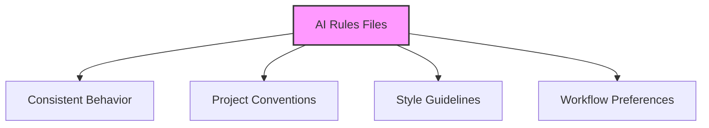
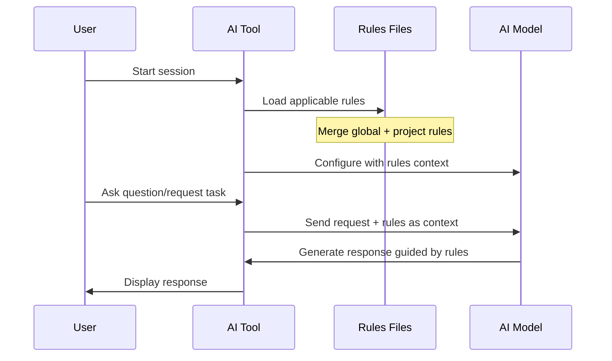
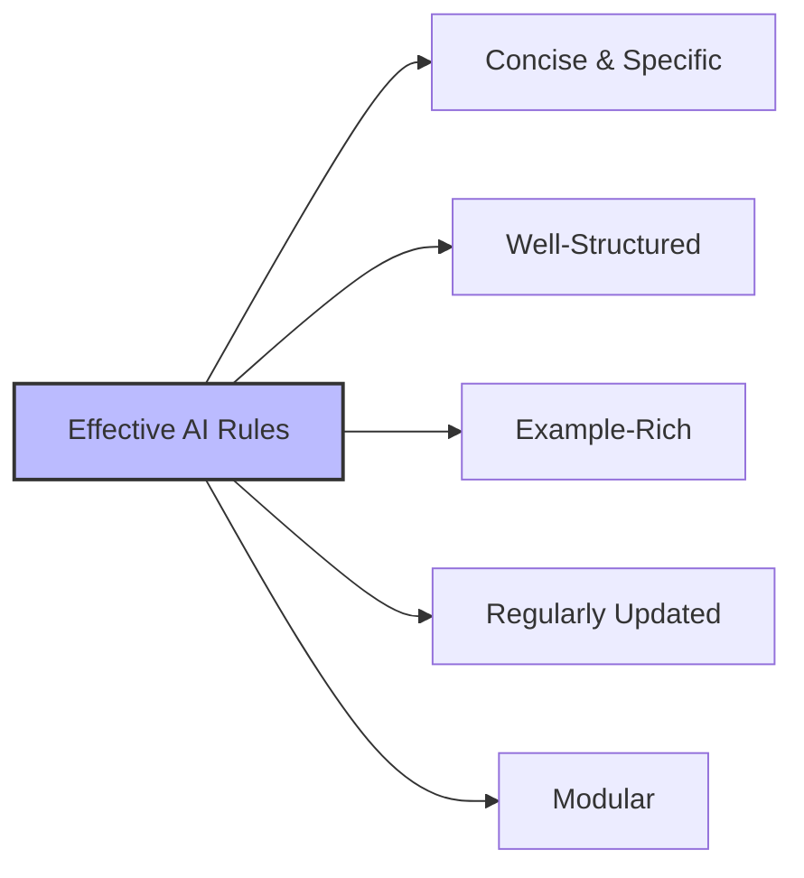
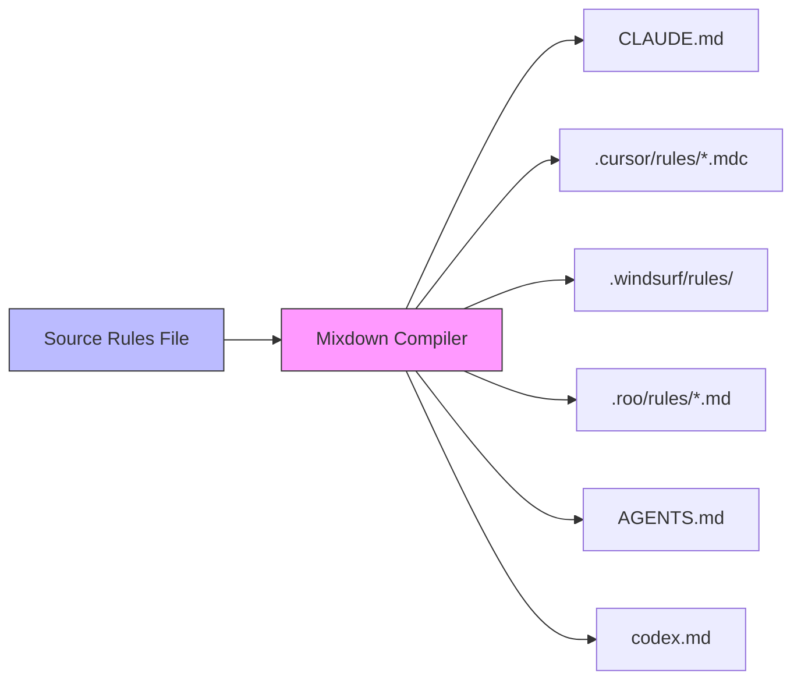
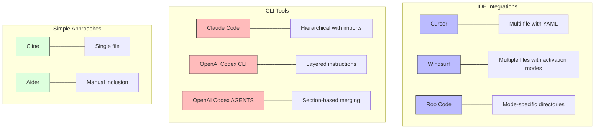

# AI Rules Overview

This guide explains how AI coding assistants use persistent rules files (often called "rules" or "memory" files) to maintain consistent behavior across sessions and projects.

## What are AI Rules Files?

AI rules files are special configuration files that provide consistent instructions to AI coding assistants. They serve as a "memory" that persists across sessions, ensuring the AI follows your project's conventions, style guides, and requirements.



## Where Rules Files Live

Different AI tools use different file locations and naming conventions:

| Tool | Project Rules | Global/User Rules | Format |
|------|--------------|-------------------|--------|
| **[Claude Code](./plugins/claude-code/rules-use.md)** | `CLAUDE.md` in root and/or subdirs | `~/.claude/CLAUDE.md` | Markdown with `@file` imports |
| **[Cursor](./plugins/cursor/rules-use.md)** | `.cursor/rules/*.mdc` files + nested `.cursor/rules/` in subdirs (v0.50+) | User settings (UI-based) | Markdown with YAML front-matter and `@filename` imports |
| **[Windsurf](./plugins/windsurf/rules-use.md)** | `.windsurf/rules/*.md` files (v1.9+) | `~/.config/windsurf/global_rules.md` | Markdown with YAML-ish front-matter and `@path` imports |
| **[Roo Code](./plugins/roo-code/rules-use.md)** | `.roo/rules/` and `.roo/rules-{mode}/` folders | No built-in global file | Markdown files in folders |
| **[OpenAI Codex CLI](./plugins/codex-cli/rules-use.md)** | `codex.md` in root | `~/.codex/instructions.md` | Markdown text |
| **[OpenAI Codex AGENTS](./plugins/codex-agent/rules-use.md)** | `AGENTS.md` in root and/or subdirs | `~/.codex/AGENTS.md` | Pure Markdown with section headings |
| **[Cline](./plugins/cline/rules-use.md)** | `.clinerules` in root | None | Plain text |
| **[Aider](./plugins/aider/rules-use.md)** | `.aider.memory.md` (manually included) | None | Markdown |

## Directory Structure Comparison

```text
project/
├── .cursor/                       # Cursor rules directory
│   └── rules/
│       ├── coding-style.mdc        # Project-wide coding style guidelines
│       └── architecture.mdc        # Project architecture guidelines
├── .roo/                         # Roo Code rules directory 
│   ├── rules/                    # Common rules for all modes
│   │   └── coding-style.md        # General coding style guidelines
│   └── rules-architect/          # Mode-specific rules
│       └── architecture.md       # Architecture guidelines
├── .windsurf/                    # Windsurf rules directory
│   └── rules/
│       ├── coding-style.md         # Coding style guidelines
│       └── architecture.md         # Architecture guidelines
├── .clinerules                   # Cline - single project-level rules file
├── .aider.memory.md              # Aider - manually-included persistent context
├── CLAUDE.md                     # Claude Code - project memory file
├── components/                   # Project subdirectory
│   ├── .cursor/                  # Nested Cursor rules directory
│   │   └── rules/
│   │       └── component-style.mdc  # Component-specific coding style
│   ├── CLAUDE.md                 # Component-specific Claude rules
│   └── AGENTS.md                 # Component-specific Codex AGENTS rules
├── codex.md                      # OpenAI Codex CLI - project instructions
├── AGENTS.md                     # OpenAI Codex AGENTS - project rules file
└── README.md                     # Regular project files
```

## How Rules Work Across Tools

While implementation varies, the core mechanism is consistent:



## Common Patterns

1. **Layered Context:** Global rules apply to all projects, project rules override for specific projects
2. **Scoping Mechanisms:**
   - [Cursor](./plugins/cursor/rules-use.md): Rule types (always, auto-attached, agent-requested, manual) + nested rules
   - [Windsurf](./plugins/windsurf/rules-use.md): Trigger types (`always_on`, `glob`, `model_decision`, `manual`) with char limits
   - [Claude Code](./plugins/claude-code/rules-use.md): Directory-based (subdirectory CLAUDE.md files)
   - [Roo Code](./plugins/roo-code/rules-use.md): Mode-specific folders (rules-{mode}/)
   - [OpenAI Codex AGENTS](./plugins/codex-agent/rules-use.md): Directory-based loading (upward path walking) with section merging
3. **Format:** Most use Markdown for human-readability and structure
4. **Import/Reference Mechanisms:**
   - [Claude Code](./plugins/claude-code/rules-use.md): Uses `@file` syntax to import content from other files
   - [Cursor](./plugins/cursor/rules-use.md): Uses `@filename` syntax to include external file content
   - [Windsurf](./plugins/windsurf/rules-use.md): Uses `@relative/path.ext` syntax to include file contents

## Best Practices for AI Rules

- Keep rules **concise and specific** (focus on actual needs, not general advice)
- Use **bullet points under clear headings** for better parsing
- Include **code examples** for concrete guidance
- Focus on areas where the AI needs direction (coding style, project architecture)
- Update rules as your project evolves
- Consider breaking large rule sets into modular files
- Avoid including sensitive information



## Example Rule Content

```markdown
# Project Overview
This is a CommonMark-compliant rules compiler that converts Markdown to tool-specific rules files.

# Key Terminology
- **Source Rules**: Source files in Markdown format, written in Mixdown Notation.
- **Destination**: A supported tool (e.g., Cursor, Claude Code) for which Compiled Rules are generated.
- **Stem**: Delimited content blocks (e.g., `{{instructions}}...{{/instructions}}`) with optional properties.

# Coding Standards
- Follow SOLID principles and conventional commits
- Use kebab-case for filenames
- Document all public functions
```

## Rule Processing

Each tool processes rules slightly differently:

```mermaid
flowchart TD
    A[Rules Processing] --> B[Cursor]
    A --> C[Claude Code]
    A --> D[Windsurf]
    A --> E[Roo Code]
    A --> F[OpenAI Codex AGENTS]
    A --> G[OpenAI Codex CLI]
    
    B --> B1[Always Apply]
    B --> B2[Auto-Attach by glob]
    B --> B3[Agent-Requested by description]
    B --> B4[Manual reference]
    B --> B5[Nested rules in subdirs]
    B --> B6[File referencing with @filename]
    
    C --> C1[Recursive file discovery]
    C --> C2[Import with @file syntax]
    C --> C3[Directory-based scoping]
    
    D --> D1[Global rules first]
    D --> D2[Project rules override]
    D --> D3[Four activation modes]
    D --> D4[Character limits (6K per file, 12K total)]
    
    E --> E1[Common rules folder]
    E --> E2[Mode-specific rules folders]
    E --> E3[Hierarchical loading]
    
    F --> F1[Upward path walking]
    F --> F2[Last file wins for conflicts]
    F --> F3[Section-based merging]
    F --> F4[Heading-based UI navigation]
    
    G --> G1[Global instructions first]
    G --> G2[Project instructions override]
    G --> G3[Terminal integration]
    G --> G4[Command policies]
    
    style A fill:#f9f,stroke:#333,stroke-width:2px
```

## Managing Rules Across Tools

Instead of maintaining separate rule files for each AI tool, consider using Mixdown to write rules once and compile to tool-specific outputs.



## Tool Comparison



## Key Takeaways

1. AI rules files provide persistent instructions across sessions
2. Each tool has its preferred location and format, but all use Markdown
3. Effective rules are concise, specific, and well-structured
4. Consider tools like Mixdown to manage rules across multiple AI assistants
5. Update rules as your project evolves to keep AI assistance relevant

## Tool-Specific Documentation

For detailed information about each AI tool's rules implementation, see:

- [Cursor Rules System](./plugins/cursor/rules-use.md)
- [Claude Code Memory System](./plugins/claude-code/rules-use.md)
- [Windsurf Rules System](./plugins/windsurf/rules-use.md)
- [Roo Code Rules System](./plugins/roo-code/rules-use.md)
- [OpenAI Codex AGENTS System](./plugins/codex-agent/rules-use.md)
- [OpenAI Codex CLI System](./plugins/codex-cli/rules-use.md)
- [Simpler Implementations](./plugins/simpler-tools/rules-use.md)
