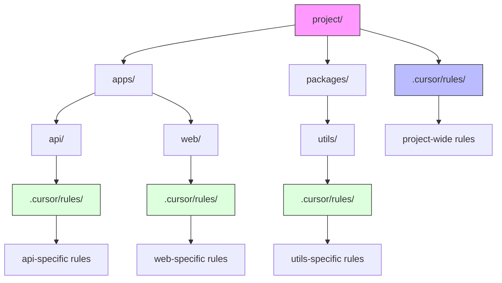

# Cursor Rules System

Cursor uses Markdown files with YAML front-matter (`.mdc` extension) organized in rules directories to guide the AI assistant.

## Key Features

- **Rule Types:** Always Apply, Auto-Attached (via globs), Agent-Requested, Manual
- **Nested Rules:** Supports `.cursor/rules/` directories in subdirectories (v0.50+)
- **Prompt Integration:** Shows which rules are active in the context panel
- **YAML Front-matter:** Controls rule behavior with structured metadata
- **UI Integration:** Rules can be managed directly from the Cursor interface

## Directory Structure

```text
project/
├── .cursor/                       # Project root rules
│   └── rules/
│       ├── always-style.mdc        # alwaysApply: true in YAML front-matter
│       └── api-conventions.mdc     # globs: ["**/api/**"] in YAML front-matter
├── frontend/
│   ├── .cursor/                  # Subdirectory-specific rules
│   │   └── rules/
│   │       └── react-standards.mdc  # Only loaded when working in frontend/
└── ...
```

## YAML Front-matter Example

```yaml
---
description: React Component Standards  
globs: ["**/components/**/*.tsx"]
alwaysApply: false
---
# React Component Guidelines
- Use functional components with hooks
- Follow naming pattern: ComponentName.tsx
```

## Rule Types

1. **Always Apply**: Rules that are always included in context for every operation
   ```yaml
   ---
   alwaysApply: true
   ---
   ```

2. **Auto-Attached**: Rules that apply only when working with matching files
   ```yaml
   ---
   globs: ["**/*.py", "**/*.ipynb"]
   ---
   ```

3. **Agent-Requested**: Rules that are only added when the AI specifically requests them
   ```yaml
   ---
   description: "Database Schema"
   ---
   ```

4. **Manual**: Rules that are only applied when manually selected by the user

## Nested Rules Feature (v0.50+, May 2025)

Cursor supports nested rule directories with automatic scoping:

- Place `.cursor/rules/` folders anywhere in your project tree
- Rules are loaded based on file relevance:
  - Root-level rules always checked first
  - Subdirectory rules only loaded when working with files in that path
  - Deeper nested rules triggered only when their specific files are involved



## Best Practices for Cursor Rules

- **One concern per file**: Keep rules small and focused
- **Use proper description and globs in front-matter**: Help both users and the AI understand when rules apply
- **Keep critical always-apply rules at the root level**: Put common patterns in the main rules directory
- **Limit nesting to 2-3 levels for maintainability**: Too deep of a structure becomes hard to manage
- **Use for domain-specific guidance in monorepos**: Particularly effective for projects with multiple technologies

## Best Practices for Nested Rules

- **Follow component architecture**: Align rule structure with your codebase organization
- **Create technology-specific rules**: e.g., React conventions in frontend directory, Python conventions in API directory
- **Document rule locations**: Include a rules index in your project README or developer documentation
- **Regularly audit and update**: Remove outdated rules and ensure content stays relevant
- **Prefer globs over always-apply for subdirectories**: More precise control over when rules are loaded

## Loading Process

When working with files in Cursor, the rules are processed as follows:

1. Load global user preferences (from Cursor settings)
2. Load all "Always Apply" rules from the root `.cursor/rules/` directory
3. Check file paths against glob patterns for "Auto-Attached" rules
4. If working in a subdirectory with a `.cursor/rules/` folder, load applicable rules
5. Add any manually selected rules
6. Merge all applicable rules into the context (with precedence for more specific rules)

## Mixdown Integration

> [!NOTE]
> 🚧 Pending Mixdown integration
