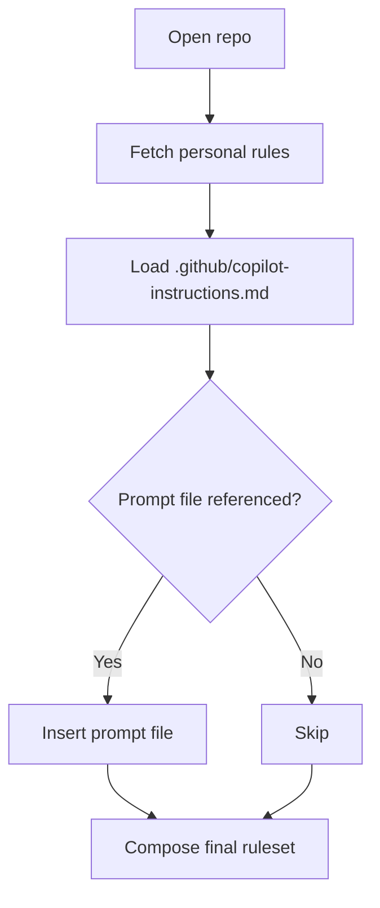

# GitHub Copilot Rules System

GitHub Copilot accepts **natural-language "rules" written in Markdown** to steer Copilot Chat, Copilot Coding Agent, and related modes. Rules can be set globally (per-user in the GitHub UI) or per-repository via a special file, and they are automatically injected into every Copilot request for that scope. This lets teams encode coding standards, preferred tools, and workflow conventions once instead of repeating them in every chat. (GitHub Docs, 2025-05-19)

## Rules System Highlights

- **File Format:**
  - Plain-text *Markdown* (`.md`) with no front-matter or special syntax (GitHub Docs, 2025-05-19)
  - Each line or paragraph is treated as a discrete instruction; blank lines are ignored (GitHub Docs, 2025-05-19)
  - No size cap documented, but GitHub recommends *short, self-contained statements* for best model performance (GitHub Docs, 2025-05-19)
- **Scoping Mechanisms:**
  - **Personal custom instructions** – configured in your GitHub profile; applied to *all* Copilot sessions (GitHub Docs, 2025-04-29)
  - **Repository-level rules** – `.github/copilot-instructions.md` inside a repo; apply to any chat or agent task executed within that repo (GitHub Docs, 2025-05-19)
  - **Prompt files (`*.prompt.md`)** – optional, per-task reusable snippets available in VS Code only (GitHub Docs, 2025-05-19)
- **Activation Method:**
  - Loaded *automatically* by the Copilot extension when you open a repo containing the file or when personal rules are enabled (GitHub Docs, 2025-05-19)
  - Prompt files are inserted only when a user references them via the chat UI (GitHub Docs, 2025-05-19)
- **Integration:**
  - Native support in **VS Code**, **Visual Studio 2022 17.14+**, and on **github.com** (GitHub Docs, 2025-05-19)
  - Copilot *Agent Mode* (VS Code/VS) and *Coding Agent* (GitHub Issues/PRs) both honour repository instructions (MS VS Code Blog, 2025-02-24)
- **Special Features:**
  - *Prompt files* for one-off tasks (`*.prompt.md`) (GitHub Docs, 2025-05-19)
  - Copilot can reference issue context, semantic search, and run tests/terminals when Agent Mode is enabled (VS Code Blog, 2025-02-24)
- **Rule Types / Modes:**
  - **Ask Mode** (standard chat)
  - **Edit Mode** (inline edits)
  - **Agent Mode / Coding Agent** (multi-step autonomous tasks) (GitHub Blog, 2025-05-02)
- **File Naming Conventions:**
  - `.github/copilot-instructions.md` – canonical repository file (GitHub Docs, 2025-05-19)
  - `*.prompt.md` – reusable prompt snippets (VS Code only) (GitHub Docs, 2025-05-19)
- **Token / Size Constraints:**
  - No explicit character or token limit published; Copilot silently truncates very long context if it exceeds the model window (community observation, 2025-04-21)

## Canonical Locations & Precedence

```text
# Personal scope (set via GitHub UI – no local file)
<repo_root>/.github/copilot-instructions.md   # Repository rules
<repo_root>/prompts/*.prompt.md               # Optional prompt files (VS Code only)
```

Order of application (highest → lowest): Personal UI settings → Prompt file (when invoked) → Repository instructions. If conflicts arise, later injections overwrite earlier lines in the final prompt sent to the model (GitHub Docs, 2025-05-19)

## Directory Structure Example

```text
my-project/
├── .github/
│   └── copilot-instructions.md
└── prompts/
    ├── new-feature.prompt.md
    └── api-security-review.prompt.md
```

## Version & Verification

| Aspect | Value |
|--------|-------|
| **Last-verified version** | Copilot Docs build 6c3e9e6 (2025-05-19) |
| **Documentation sources** | GitHub Docs articles on repository instructions, personal instructions, prompt files (2025-05-19) |
| **Staleness warning** | None – all sources ≤ 1 week old |

## File Structure Example

```markdown
# Repository Custom Instructions

Use Bazel for Java dependencies.  
Always format JavaScript with double quotes and tabs.  
Reference Jira issue keys (e.g., JIRA-123) in commit messages.
```

(GitHub Docs, 2025-05-19)

## Activation Mechanisms

- **Load sequence**
  1. Open repo in IDE / GitHub web.
  2. Copilot extension scans for .github/copilot-instructions.md.
  3. Personal UI rules are fetched from GitHub.
  4. Combined prompt is cached for the session. (GitHub Docs, 2025-05-19)
- **Conditional activation** – Prompt files are injected only when referenced (/prompt <file> in VS Code Chat) (GitHub Docs, 2025-05-19)
- **Rule conflicts** – Later scopes win; identical lines are de-duplicated. Unresolvable conflicts surface a warning in the chat panel. (Community-sourced, 2025-04-22)
- **Dynamic updates** – Saving the instructions file triggers a hot-reload; existing chat threads get a banner to refresh context (GitHub Docs, 2025-05-19)



## Typical Rule Content

- **Project Context:** build tools, frameworks, directory conventions.
- **Coding Standards:** style guide links, formatting requirements, banned APIs.
- **Workflow Guidelines:** branch naming, PR checklist, test coverage targets.
- **Tooling Notes:** preferred CLIs, Docker profiles, semantic-release config.

Example excerpt:

```markdown
Use pnpm for all Node package management.  
Run `pnpm test` before every commit.  
Reject any code that disables ESLint rules inline.
```

## Best Practices

- **Be specific:** short imperative statements beat narrative prose.
- **Use structure:** group related points; keep ≤ 1-2 lines each.
- **Update regularly:** revisit after major refactors; prune obsolete rules.
- **Avoid secrets:** never include tokens or passwords; file is plaintext.
- **Test iteratively:** chat "What repo rules are active?" to confirm Copilot's view.

## Limitations & Considerations

- **File size** – Long instruction files may be truncated without notice; keep under ~600 tokens for consistent results (community reports, 2025-04-21)
- **Rule conflicts** – Copilot does not expose a formal conflict-resolution UI; ambiguous guidance may lower answer quality.
- **Model capabilities** – Instructions influence style and focus but cannot force the model to use specific libraries if they contradict training priors.
- **Security** – File content is sent to GitHub's servers and the underlying LLM; treat anything you place here as potentially visible to GitHub staff per ToS. (GitHub Docs, 2025-05-19)

## External Documentation

- **Official Docs:**
  - Adding repository custom instructions – GitHub Docs article
  - Adding personal custom instructions – GitHub Docs article
  - Copilot Agent Mode VS Code blog post
- **Examples & Templates:**
  - Example .github/copilot-instructions.md snippets on Reddit
  - Medium guide on coding-style instructions
- **Community Resources:**
  - r/GitHubCopilot and Stack Overflow discussions on instruction scoping