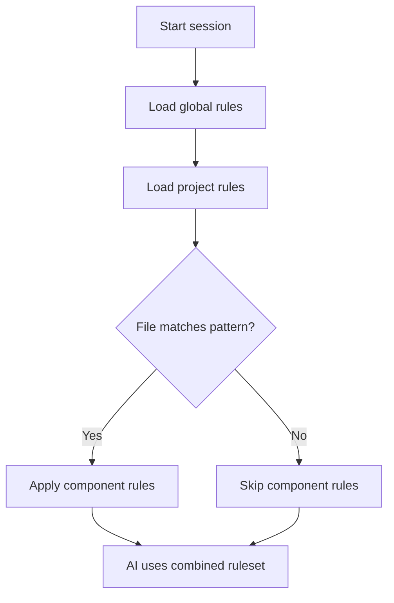

<template>

<content>

# [ Provider Name ] Rules System

[ Brief description of how this provider implements AI instructions/rules ]

<!-- AI: Include the provider's purpose, primary implementation approach, and what makes it unique, in 1-3 sentences -->

## Rules System Highlights

- **File Format:**
  - [ e.g., Markdown with YAML front-matter ]
  - [ Additional details about the file format structure ]
  - [ Any format-specific limitations or capabilities ]
- **Scoping Mechanisms:**
  - [ e.g., global user-level rules ]
  - [ e.g., project-level rules ]
  - [ e.g., directory or component-specific rules ]
- **Activation Method:**
  - [ e.g., automatic loading at startup ]
  - [ e.g., manual activation via commands ]
  - [ e.g., conditional activation based on file types ]
- **Integration:**
  - [ e.g., IDE plugin with UI controls ]
  - [ e.g., CLI commands for rule management ]
  - [ e.g., web interface capabilities ]
- **Special Features:**
  - [ e.g., templating system for rules ]
  - [ e.g., import/include mechanisms ]
  - [ e.g., variable substitution ]
  - [ e.g., conditional rule sections ]
- **Rule Types / Modes:**
  - [ e.g., Always-on vs. Model-decision vs. Manual ]
  - [ e.g., mode-specific folders like `rules-architect/` ]
- **File Naming Conventions:**
  - [ Canonical filenames (`AGENTS.md`, `.windsurfrules`, `.cursor/rules/*.mdc`, etc.) ]
  - [ Legacy aliases or deprecated names ]
- **Token / Size Constraints:**
  - [ Per-file and cumulative limits, if applicable ]
  - [ Behaviour when limits are exceeded (truncation, warnings) ]

## Canonical Locations & Precedence

<!-- AI: Describe where rule files are stored and their precedence order -->

```text
~/.config/[ provider ]/rules.md         # User-level rules
<project_root>/.[ provider ]/rules.md   # Project-level rules
<project_root>/path/to/.rules.md        # Component-specific rules
[ Additional locations if applicable ]
<cwd>/rules.md                         # Working-directory overrides, if supported
```

## Directory Structure Example

```text
$HOME/
├── .config/[ provider ]/
│   └── rules.md                # Global rules
└── projects/
    └── myproject/
        ├── .[ provider ]/      # Project rules
        │   └── rules.md
        └── src/
            └── moduleA/
                └── .rules.md   # Module-specific rules
```

## Version & Verification

| Aspect | Placeholder |
|--------|-------------|
| **Last-verified version / commit** | `[ e.g., v0.48.2 (2025-05-10) ]` |
| **Documentation source & date**    | `[ link + absolute date ]` |
| **Staleness warning**              | `[ Flag info > 6 months old ]` |

<!-- AI: The example above is just a placeholder. The specific directory structure will vary based on the provider. -->

## File Structure Example

```markdown
---
description: "Project coding standards"
globs: ["**/*.js"]
activation: "automatic"
---

# Coding Standards

- Always use ES6 features
- Prefer async/await over Promises
- Format code with Prettier

# Testing Requirements

- Write unit tests for all functions
- Maintain 80% test coverage
```

<!-- AI: If the provider supports multiple file formats or structures, add additional examples. -->
<!-- AI: Some tools have differences in frontmatter syntax, especially `globs` and otherwise. Use this purely as an example. -->

## Activation Mechanisms

<!-- AI: Describe how rules are loaded and when they become active -->

- **When rules are loaded:**
  - [ Details around how rules are loaded (startup, file open, explicit command) ]
  - [ Add additional details as needed with multiple sublist items ]
- **Conditional activation:**
  - [ Details around how rules are activated (file pattern matching, AI mode switching) ]
  - [ Add additional details as needed with multiple sublist items ]
- **Rule conflicts:**
  - [ Details around how rules are resolved (provider-specific precedence) ]
  - [ Add additional details as needed with multiple sublist items ]
- **Dynamic updates:**
  - [ Allow rules to be modified during a session if supported ]
  - [ Add additional details as needed with multiple sublist items ]



## Typical Rule Content

Effective [ provider name ] rules typically include:

- **Project Context:**
  - [ Technology stack descriptions (frameworks, languages) ]
  - [ Architecture overview (components, services) ]
  - [ Project goals and principles ]
  - [ Team structure and responsibilities ]
- **Coding Standards:**
  - [ Style guidelines (indentation, naming conventions) ]
  - [ Patterns to use (architectural patterns, design patterns) ]
  - [ Anti-patterns to avoid ]
  - [ Code organization principles ]
- **Workflow Guidelines:**
  - [ PR process and requirements ]
  - [ Testing standards and expectations ]
  - [ Documentation expectations ]
  - [ Version control practices ]

Example:

```markdown
# Project Overview
This is a React application using TypeScript and Tailwind CSS.

# Coding Standards
- Follow AirBnB style guide
- Use functional components with hooks

# Testing Requirements
- Write tests for all components
```

## Best Practices

[ Best practices for writing (provider-name) rules. Follow the example below.]

<best_practices_example>
- **Be specific:**
  - Provide clear, actionable guidance rather than vague suggestions
  - Include concrete examples of what to do and what to avoid
  - Use precise language that leaves little room for interpretation
- **Use structure:**
  - Organize content with consistent headings and subheadings
  - Utilize lists and tables for better scanability
  - Include code blocks for technical guidance
  - Maintain a logical flow of information
- **Include examples:**
  - Show ideal code patterns alongside guidelines
  - Contrast good examples with anti-patterns
  - Use realistic examples from your actual codebase
- **Scope appropriately:**
  - Apply rules only where they make sense
  - Use file globs or path specifications for targeted rules
  - Consider different rules for different parts of the codebase
- **Keep updated:**
  - Revise rules as the project evolves
  - Schedule regular reviews of rule content
  - Communicate changes to the team
- **Version control:**
  - Store project rules in your repository
  - Document the history and rationale for rule changes
  - Use PRs for significant rule modifications
</best_practices_example>

## Limitations and Considerations

- **File size limits:**
  - [ Maximum size of rule files supported by the provider ]
  - [ Performance impacts as file size increases ]
  - [ Strategies for managing large rule sets ]
  - [ Token window constraints of the underlying model, if applicable ]
  - [ Truncation or summarisation behaviour when exceeded, if applicable ]
<!-- AI: Only include token constraints if relevant to this provider. Some providers may not have explicit token limits, in which case this can be omitted -->
- **Rule conflicts:**
  - [ How contradictory instructions are handled ]
  - [ Precedence rules between different rule sources ]
  - [ Debugging tools for rule conflict resolution ]
- **Model capabilities:**
  - [ Effectiveness depends on the underlying AI model ]
  - [ Areas where rule following is particularly strong/weak ]
  - [ Handling of ambiguous or complex instructions ]
- **Security:**
  - [ Avoid storing sensitive information in rules ]
  - [ How rule content is processed and stored ]
  - [ Permissions considerations for rule access ]

## External Documentation

- **Official Resources:**
  - [ GitHub repository - link with brief description ]
  - [ Official documentation - link with key sections highlighted ]
  - [ API reference - if applicable ]
  - ...
- **Examples & Templates:**
  - [ Example rule files - with descriptions of what each demonstrates ]
  - [ Rule templates for common use cases ]
  - [ Community-contributed rules repositories ]
  - ...
- **Community Resources:**
  - [ Blog posts or articles about this provider ]
  - [ Forums or discussion groups ]
  - [ Video tutorials or presentations ]
  - ...

<optional_content>

[ Include additional content as may be relevant to the specific provider. Follow similar structure to the above. ]

</optional_content>

</content>

<mixdown_specific_content>

<instructions>
    - Only include the following content if the provider is supported by the Mixdown compiler **today**.
    - If the provider is not supported by Mixdown today, do not include the following content.
</instructions>

<documentation_template>
## Integration with Mixdown

When using Mixdown to generate [ provider name ] rules files:

```yaml
---
mixdown:
  version: 0.1.0
description: "[ Description ]"
[ provider-specific ]:
  setting1: value1
  setting2: value2
---
```

Example content:

```markdown
# {{$section}}

{{> template-name }}

# {{$section}}

{{> template-name }}
```

## Internal Documentation

- **Mixdown Integration:**
  - [[provider name] Rules Overview](../../rules-overview.md)
  - [ Provider implementation details - with brief explanation ]
  - [ Target-specific configuration options ]
- **Provider Implementation:**
  - [ Link to related internal provider documentation ]
  - [ Architecture diagrams or explanations ]
  - [ Integration points with other systems ]

</documentation_template>

</mixdown_specific_content>

</template>