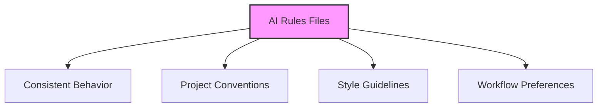
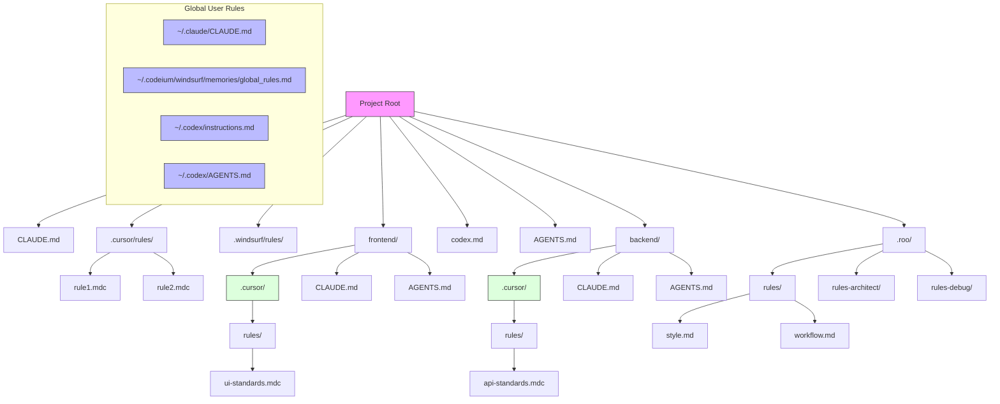
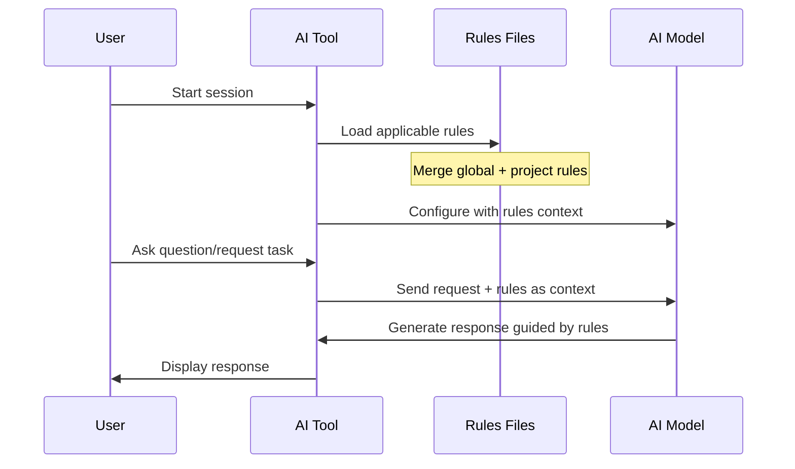
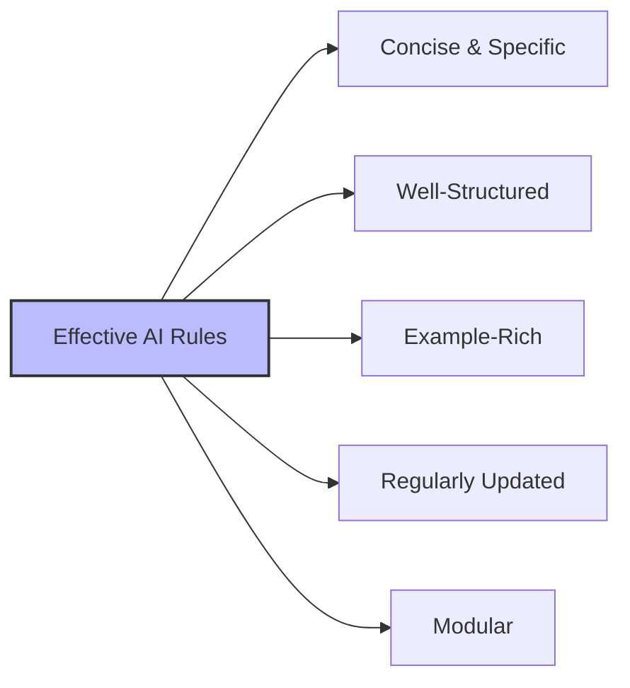
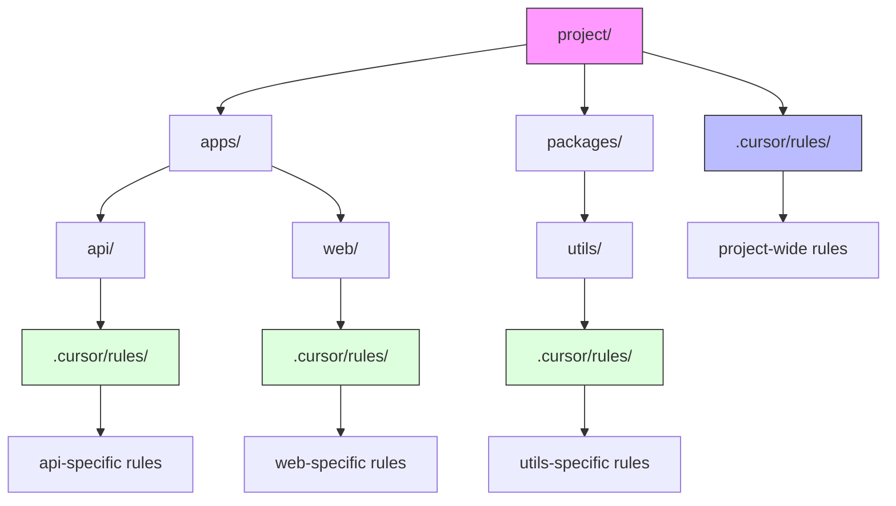
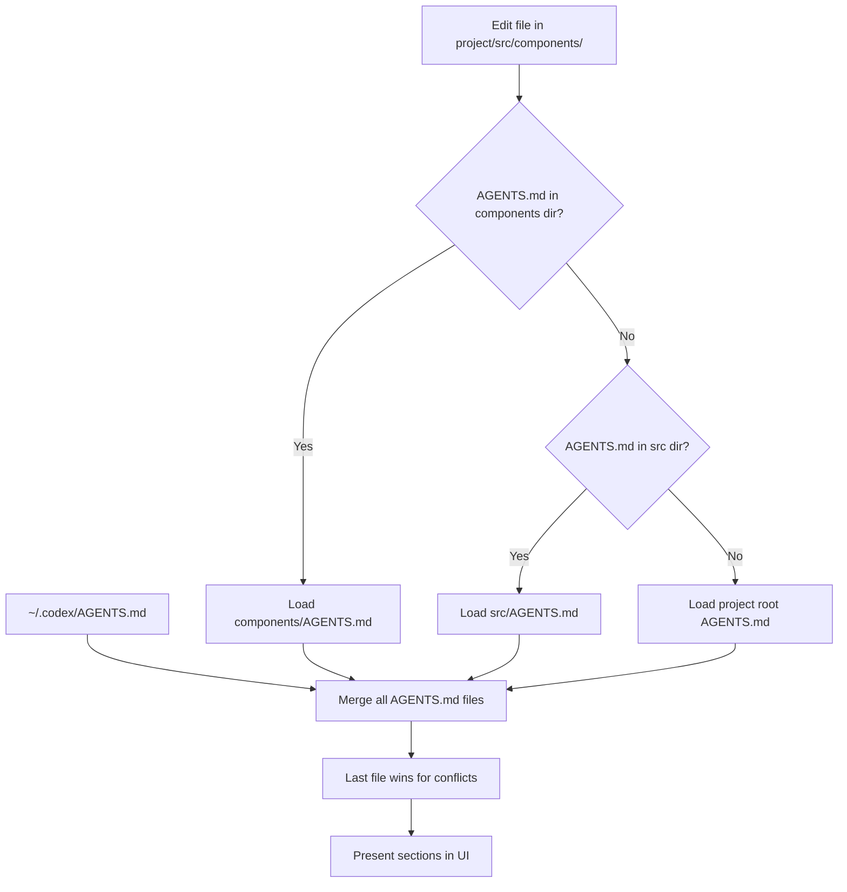
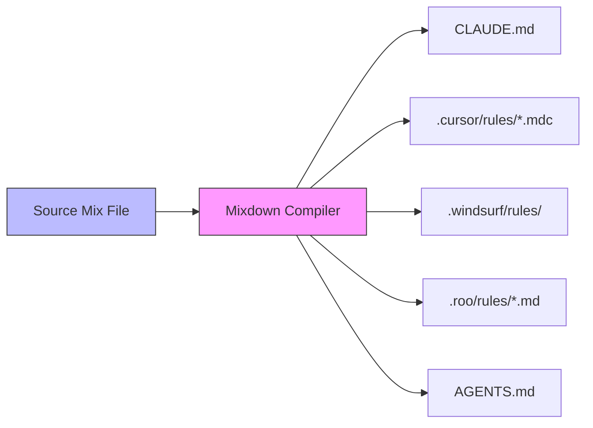
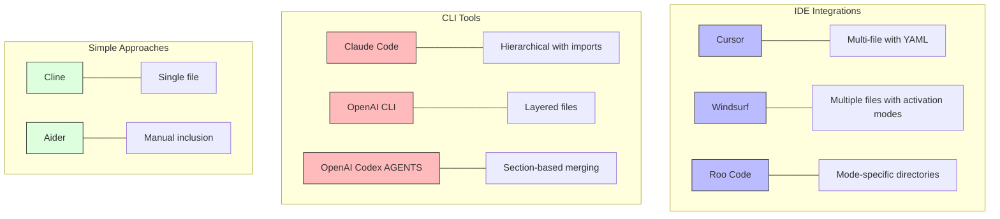

# AI Rules Guide

This guide explains how AI coding assistants use persistent instruction files (often called "rules" or "memory" files) to maintain consistent behavior across sessions and projects.

- [AI Rules Overview](#ai-rules-overview)
    - [What are AI Rules Files?](#what-are-ai-rules-files)
    - [Where Rules Files Live](#where-rules-files-live)
    - [Directory Structure Comparison](#directory-structure-comparison)
- [How Rules Work Across Tools](#how-rules-work-across-tools)
    - [Common Patterns](#common-patterns)
- [Best Practices for AI Rules](#best-practices-for-ai-rules)
- [Rule Processing](#rule-processing)
    - [Example Rule Content](#example-rule-content)
- [Tool-Specific Implementation Details](#tool-specific-implementation-details)
    - [Cursor Rules System](#cursor-rules-system)
        - [Nested Rules Feature (v0.48+, Mar 2025)](#nested-rules-feature-v048-mar-2025)
        - [Best Practices for Nested Rules](#best-practices-for-nested-rules)
    - [Claude Code Memory System](#claude-code-memory-system)
    - [Windsurf Rules System](#windsurf-rules-system)
    - [Roo Code Rules System](#roo-code-rules-system)
    - [OpenAI Codex AGENTS System](#openai-codex-agents-system)
    - [Simpler Implementations](#simpler-implementations)
- [Managing Rules Across Tools](#managing-rules-across-tools)
- [Tool Comparison](#tool-comparison)
- [Key Takeaways](#key-takeaways)

## AI Rules Overview

### What are AI Rules Files?

AI rules files are special configuration files that provide consistent instructions to AI coding assistants. They serve as a "memory" that persists across sessions, ensuring the AI follows your project's conventions, style guides, and requirements.



### Where Rules Files Live

Different AI tools use different file locations and naming conventions:

| Tool | Project Rules | Global/User Rules | Format |
|------|--------------|-------------------|--------|
| **Claude Code** | `CLAUDE.md` in root and/or subdirs | `~/.claude/CLAUDE.md` | Markdown with `@file` imports |
| **Cursor** | `.cursor/rules/*.mdc` files + nested `.cursor/rules/` in subdirs (v0.48+) | User settings (UI-based) | Markdown with YAML front-matter |
| **Windsurf** | `.windsurf/rules/*.md` files (v1.8.2+) | `~/.codeium/windsurf/memories/global_rules.md` | Markdown with activation modes (Always On, Manual, Model Decision, Glob) |
| **Roo Code** | `.roo/rules/` and `.roo/rules-{mode}/` folders | No built-in global file | Markdown files in folders |
| **OpenAI Codex CLI** | `codex.md` in root | `~/.codex/instructions.md` | Markdown text |
| **OpenAI Codex AGENTS** | `AGENTS.md` in root and/or subdirs | `~/.codex/AGENTS.md` | Pure Markdown with section headings |

### Directory Structure Comparison

```text
project/
├── .cursor/                       # Cursor rules directory
│   └── rules/
│       ├── coding-style.mdc        # Project-wide coding style guidelines
│       └── architecture.mdc        # Project architecture guidelines
├── .roo/                         # Roo Code rules directory 
│   ├── rules/                    # Common rules for all modes
│   │   └── coding-style.md        # General coding style guidelines
│   └── rules-architect/          # Mode-specific rules
│       └── architecture.md       # Architecture guidelines
├── .windsurf/                    # Windsurf rules directory
│   └── rules/
│       ├── coding-style.md         # Coding style guidelines
│       └── architecture.md         # Architecture guidelines
├── .clinerules                   # Cline - single project-level rules file
├── .aider.memory.md              # Aider - manually-included persistent context
├── CLAUDE.md                     # Claude Code - project memory file
├── components/                   # Project subdirectory
│   ├── .cursor/                  # Nested Cursor rules directory
│   │   └── rules/
│   │       └── component-style.mdc  # Component-specific coding style
│   ├── CLAUDE.md                 # Component-specific Claude rules
│   └── AGENTS.md                 # Component-specific Codex AGENTS rules
├── codex.md                      # OpenAI Codex CLI - project instructions
├── AGENTS.md                     # OpenAI Codex AGENTS - project rules file
└── README.md                     # Regular project files
```



## How Rules Work Across Tools

While implementation varies, the core mechanism is consistent:



### Common Patterns

1. **Layered Context:** Global rules apply to all projects, project rules override for specific projects
2. **Scoping Mechanisms:**
   - Cursor: Rule types (always, auto-attached, agent-requested, manual) + nested rules in subdirectories
   - Windsurf: Activation modes (Always On, Manual, Model Decision, Glob) with 6K char limit per file
   - Claude Code: Directory-based (subdirectory CLAUDE.md files)
   - Roo Code: Mode-specific folders (rules-{mode}/)
   - OpenAI Codex AGENTS: Directory-based loading (upward path walking) with section merging
3. **Format:** Most use Markdown for human-readability and structure

## Best Practices for AI Rules

- Keep rules **concise and specific** (focus on actual needs, not general advice)
- Use **bullet points under clear headings** for better parsing
- Include **code examples** for concrete guidance
- Focus on areas where the AI needs direction (coding style, project architecture)
- Update rules as your project evolves
- Consider breaking large rule sets into modular files
- Avoid including sensitive information



## Rule Processing

Each tool processes rules slightly differently:

```mermaid
flowchart TD
    A[Rules Processing] --> B[Cursor]
    A --> C[Claude Code]
    A --> D[Windsurf]
    A --> E[Roo Code]
    A --> F[OpenAI Codex AGENTS]
    
    B --> B1[Always Apply]
    B --> B2[Auto-Attach by glob]
    B --> B3[Agent-Requested]
    B --> B4[Manual]
    B --> B5[Nested rules in subdirs]
    
    C --> C1[Recursive file discovery]
    C --> C2[Import with @file syntax]
    C --> C3[Directory-based scoping]
    
    D --> D1[Global rules first]
    D --> D2[Project rules override]
    D --> D3[Four activation modes]
    D --> D4[Character limits (6K per file, 12K total)]
    
    E --> E1[Common rules folder]
    E --> E2[Mode-specific rules folders]
    E --> E3[Hierarchical loading]
    
    F --> F1[Upward path walking]
    F --> F2[Last file wins for conflicts]
    F --> F3[Section-based merging]
    F --> F4[Heading-based UI navigation]
    
    style A fill:#f9f,stroke:#333,stroke-width:2px
```

### Example Rule Content

```markdown
# Project Overview
This is a CommonMark-compliant prompt compiler that converts Markdown to tool-specific outputs.

# Key Terminology
- **Mix**: Source files in Markdown format
- **Target**: Output destination (tool-specific)
- **Track**: Delimited content blocks with attributes

# Coding Standards
- Follow SOLID principles and conventional commits
- Use kebab-case for filenames
- Document all public functions
```

## Tool-Specific Implementation Details

### Cursor Rules System

Cursor uses Markdown files with YAML front-matter (`.mdc` extension) organized in rules directories.

**Key Features:**

- **Rule Types:** Always Apply, Auto-Attached (via globs), Agent-Requested, Manual
- **Nested Rules:** Supports `.cursor/rules/` directories in subdirectories (v0.48+)
- **Prompt Integration:** Shows which rules are active in the context panel

**Directory Structure:**

```text
project/
├── .cursor/                       # Project root rules
│   └── rules/
│       ├── always-style.mdc        # alwaysApply: true in YAML front-matter
│       └── api-conventions.mdc     # globs: ["**/api/**"] in YAML front-matter
├── frontend/
│   ├── .cursor/                  # Subdirectory-specific rules
│   │   └── rules/
│   │       └── react-standards.mdc  # Only loaded when working in frontend/
└── ...
```

**YAML Front-matter Example:**

```yaml
---
description: React Component Standards  
globs: ["**/components/**/*.tsx"]
alwaysApply: false
---
# React Component Guidelines
- Use functional components with hooks
- Follow naming pattern: ComponentName.tsx
```

#### Nested Rules Feature (v0.48+, Mar 2025)

Cursor supports nested rule directories with automatic scoping:

- Place `.cursor/rules/` folders anywhere in your project tree
- Rules are loaded based on file relevance:
  - Root-level rules always checked first
  - Subdirectory rules only loaded when working with files in that path
  - Deeper nested rules triggered only when their specific files are involved



#### Best Practices for Nested Rules

- One concern per file: keep rules small and focused
- Use proper description and globs in front-matter
- Keep critical always-apply rules at the root level
- Limit nesting to 2-3 levels for maintainability
- Use for domain-specific guidance in monorepos

### Claude Code Memory System

Claude Code uses plain Markdown files (`CLAUDE.md`) with a powerful import system to manage persistent rules.

**Key Features:**

- **Hierarchical Loading:** Loads CLAUDE.md files from root directory and relevant subdirectories
- **Import Mechanism:** `@file` syntax to pull in content from other files
- **Global + Project:** Combines global user preferences with project-specific rules

**Directory Structure:**

```text
$HOME/
├── .claude/
│   └── CLAUDE.md                 # Global user preferences
└── projects/
    └── myproject/
        ├── CLAUDE.md                 # Project-level memory file
        ├── docs/
        │   └── ARCHITECTURE.md       # Documentation referenced by imports
        └── api/
            └── CLAUDE.md             # Component-specific memory (loaded when in API context)
```

**Import Example:**

```markdown
# Project Guidelines
See @docs/ARCHITECTURE.md for the system overview.

# Coding Standards
- Follow RESTful principles for API endpoints
- Document all functions with JSDoc comments
```

### Windsurf Rules System

Windsurf (v1.8.2+) uses a flexible folder-based rules system with multiple activation modes.

**Key Features:**

- **Activation Modes:** Always On, Manual, Model Decision, Glob (file patterns)
- **Character Limits:** 6K per file, 12K total across all rules
- **UI Integration:** Rules can be toggled and edited through the Windsurf UI

**Directory Structure:**

```text
project/
├── .windsurf/
│   └── rules/
│       ├── 01-basics.md            # Always On activation mode
│       ├── typescript.md           # Glob activation mode for TS files
│       └── security.md             # Model Decision activation mode
└── ...

$HOME/.codeium/windsurf/memories/
└── global_rules.md              # Global user preferences
```

### Roo Code Rules System

Roo Code organizes rules by AI mode in specific directories to target certain AI behaviors.

**Key Features:**

- **Mode-Specific Rules:** Different rules for different operational modes
- **Common Rules:** Shared rules for all modes
- **Folder Structure:** One folder per mode plus common rules

**Directory Structure:**

```text
project/
├── .roo/
│   ├── rules/                    # Common rules for all modes
│   │   ├── coding-style.md        # Applied regardless of mode
│   │   └── terminology.md         # Project glossary and terms
│   ├── rules-architect/          # For Architect mode only
│   │   └── architecture.md       # System design principles
│   ├── rules-debug/              # For Debug mode only
│   │   └── debugging.md          # Debugging procedures
│   └── rules-docs-writer/        # For Documentation mode only
│       └── doc-standards.md       # Documentation guidelines
└── ...
```

### OpenAI Codex AGENTS System

OpenAI Codex uses a section-based merging approach with a hierarchical loading system for its AGENTS.md files.

**Key Features:**

- **Hierarchical Loading:** Loads AGENTS.md files from personal, project, and subdirectory levels
- **Section-Based Merging:** Uses Markdown headings (## ...) as section labels for organization
- **Path Walking:** For edited files, walks upward from file path, stopping at first AGENTS.md
- **UI Integration:** Section headings are surfaced in the UI for navigation
- **Conflict Resolution:** Last file wins for conflicting sections (deeper files override shallower)

**Canonical Locations & Precedence (highest → lowest):**

```text
~/.codex/AGENTS.md                # Personal, applies to every repo
<repo-root>/AGENTS.md             # Project-wide defaults
<any-subdir>/AGENTS.md            # Loaded only when files in that dir are touched
```

**File Structure Example:**

```markdown
## Coding Standards
- Use tabs for indentation
- Follow PEP 8 for Python code
- Maximum line length is 80 characters

## Error Handling
- Use structured error objects
- Log all errors with contextual information
- Handle all Promise rejections

## Testing
- Write unit tests for all new functionality
- Use descriptive test names
- Mock external dependencies
```

**Loading Behavior:**



**Best Practices for AGENTS.md:**

- Keep it short & actionable (long docs may be truncated)
- One concern per heading for clear organization
- Use imperative bullets for instructions
- Create sub-folder AGENTS.md files in monorepos
- Avoid duplicating code-style rules that can be better handled by linters
- Can disable loading with `codex --no-project-doc` or `CODEX_DISABLE_PROJECT_DOC=1`

### Simpler Implementations

**Cline:** Uses a single `.clinerules` file in the project root.

**Aider:** Commonly uses `.aider.memory.md` which must be manually included at startup.

**OpenAI Codex CLI:** Uses a layered system with global `~/.codex/instructions.md` and project-level `codex.md`.

**OpenAI Codex AGENTS:** Uses a hierarchical system with heading-based section merging across multiple AGENTS.md files.

## Managing Rules Across Tools

Instead of maintaining separate rule files for each AI tool, consider using Mixdown to write rules once and compile to tool-specific outputs.



## Tool Comparison



## Key Takeaways

1. AI rules files provide persistent instructions across sessions
2. Each tool has its preferred location and format, but all use Markdown
3. Effective rules are concise, specific, and well-structured
4. Consider tools like Mixdown to manage rules across multiple AI assistants
5. Update rules as your project evolves to keep AI assistance relevant
